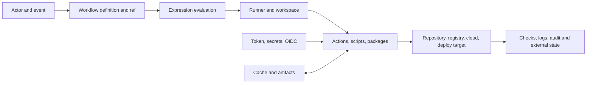

# Security and reliability for GitHub Actions

> Advanced course · reviewed against current platform guidance on 2026-09-27 ·
> workflow-native lab with safe, deterministic attack-path fixtures

GitHub Actions workflows are privileged programs expressed in YAML. They choose
which code runs, which identity it receives, which network and persistent state
it can reach, and which result becomes a merge or release gate. A workflow that
is syntactically valid can still let an attacker cross from an untrusted pull
request into a write token, secret, trusted cache, release artifact, cloud role,
or persistent runner.

This course treats security and reliability as one engineering problem: preserve
the intended trust boundary and reach one explainable terminal state even when
inputs are hostile, dependencies move, runners fail, or external writes return
ambiguous results.

## Learning outcomes

After completing the chapter and workflow lab, you can:

1. model a workflow as **input trust → selected definition → runner → code and
   dependencies → credentials → persistent state → side effect**;
2. trace `pull_request`, `pull_request_target`, `workflow_run`, `push`, and manual
   events to the workflow revision, ref, token, secrets, cache, artifact, and
   runner they can influence;
3. prove or reject attack paths involving pwn requests, template injection,
   compromised actions, caches, artifacts, package lifecycle scripts, and
   persistent runners;
4. scope `GITHUB_TOKEN`, OIDC, secrets, environments, action pins, checkout
   credentials, caches, and runners to the minimum authority and lifetime;
5. use `actionlint`, `zizmor`, CodeQL workflow analysis, dependency review,
   OpenSSF Scorecard, Dependabot, and runtime egress evidence for their distinct
   purposes;
6. implement negative authorization tests and a stable required security check;
7. design timeouts, concurrency, idempotency, reconciliation, and fail-closed
   gates that remain safe during partial failure; and
8. measure attack-path closure rather than claiming that “the scanner passed.”

## Prerequisites, scenario, and boundaries

Complete [Workflow design](../../intermediate/01-workflow-design/README.md) and
[Deployment patterns](../../intermediate/02-deployment-patterns/README.md)
first. You should already understand events, job DAGs, reusable workflows,
artifacts, environments, OIDC, and reconciliation.

**Scenario.** Northstar maintains a public delivery CLI. Fork pull requests must
run useful tests. Trusted tag releases may publish an attested binary through a
protected environment. The security team needs evidence that a contributor
cannot turn validation into repository or cloud authority, poison state later
consumed by a privileged job, or hide a dangerous retry behind a green check.

**Success criteria.** You will identify all labeled findings in six vulnerable
workflow fixtures, reduce the course model from 81 risk points to zero in their
hardened counterparts, make nine authorization decisions exactly, run a real
workflow scanner against the installed lab, and expose one stable check suitable
for branch protection. The point score is a deterministic teaching measure, not
a universal risk formula.

**Non-goals.** The lab does not exploit GitHub, exfiltrate a token, contact a
cloud account, publish a package, or claim that static analysis proves safety.
It does not replace application security, dependency testing, organization-wide
incident response, or a provider-specific IAM review.

**Safety boundary.** Work in a fork or disposable practice repository. Never
install files under `fixtures/vulnerable/`; they use `.yml.txt` deliberately so
GitHub will not execute them. The runnable workflows are read-only, credential-
free, and use GitHub-hosted runners. `harden-runner` is in audit mode. Do not add
real secrets, write tokens, self-hosted runner labels, package publication, or
cloud credentials to the exercise.

## Mental model: authority follows data and code

A review should answer four questions for every path:

1. **Who can influence the input?** A fork author can change source, lockfiles,
   tests, build scripts, Dockerfiles, action metadata, filenames, PR text, and
   artifacts produced from that source.
2. **What executes it?** GitHub compiles expressions into generated scripts,
   actions can execute arbitrary code, package managers can run lifecycle
   scripts, and downloaded artifacts may become executable.
3. **What authority is present?** Consider `GITHUB_TOKEN`, secrets, OIDC token
   requests, environment credentials, runner network access, cache write access,
   and credentials persisted by checkout—not merely the visible `permissions`.
4. **What survives the job?** Repository writes, releases, packages, caches,
   artifacts, deployment state, external APIs, and self-hosted runner state can
   outlive an ephemeral process.



The critical invariant is:

> Data or code controlled by a less-trusted actor must not reach a more-trusted
> interpreter or mutation capability without an explicit validation and
> authorization boundary.

A scanner warning is useful evidence, but the attack graph is the unit of
reasoning. A mutable action with a read-only token can still steal an explicit
secret. A perfectly pinned workflow can still execute attacker-controlled
`package.json` scripts on a privileged runner. A checksum proves bytes, not who
was authorized to choose those bytes.

## Foundations: identities, definitions, and permissions

### Workflow identity and source selection

The event determines which workflow definition and ref GitHub evaluates. A
normal `pull_request` validates a pull-request merge context and is the default
choice for testing fork code without secrets. `pull_request_target` evaluates in
the base repository context and may have base-repository secrets and token
authority, so combining it with execution of fork code creates a **pwn request**.
The same pattern can appear under `issue_comment` or `workflow_run` if a
privileged workflow fetches or downloads attacker-controlled code and executes
it. GitHub's [secure `pull_request_target` reference](https://docs.github.com/en/actions/reference/security/securely-using-pull_request_target)
documents the exact data flows and the protections in current checkout releases.

`actions/checkout` v7 refuses common fork-head checkout patterns in privileged
events by default. That is defense in depth, not permission to keep a dangerous
architecture: direct `git fetch`, `gh pr checkout`, unrelated repositories, and
downloaded artifacts can still reintroduce the path. An opt-out named
`allow-unsafe-pr-checkout` is a review alarm, not a safety control.

### Job tokens and checkout persistence

GitHub creates a job-scoped `GITHUB_TOKEN`; permissions are limited to its
repository and the token expires after the job. A compromised step can still use
every permission granted during that job. Set a restrictive workflow default,
then grant a narrow job permission only where the job requires it:

```yaml
permissions:
  contents: read

jobs:
  publish:
    permissions:
      contents: write
      id-token: write
```

Unspecified permissions become `none` after any explicit permission is set.
`id-token: write` authorizes an OIDC token request; the cloud policy—not this
YAML flag—decides what the identity may do. Constrain issuer, audience,
repository or numeric repository identity, workflow ref, ref or environment,
and provider role. See the official [`GITHUB_TOKEN` permission model](https://docs.github.com/en/actions/how-tos/security-for-github-actions/security-guides/automatic-token-authentication)
and [OIDC reference](https://docs.github.com/en/actions/reference/security/oidc).

Checkout normally configures credentials so later Git commands can authenticate.
Use `persist-credentials: false` when later steps do not need that capability.
This does not erase other tokens or secrets in the job; it removes one ambient
credential path.

### Secrets are job data, not a perimeter

Any code in a job that receives a secret should be assumed able to read it.
Masking reduces accidental log exposure but is not an access-control boundary,
and structured or transformed secrets may evade masking. Prefer no secret,
then OIDC with a short-lived provider token, then an environment-scoped secret
with protection and rotation. Separate untrusted build/test work from privileged
publication rather than trying to “hide” a secret from earlier steps.

## Internal mechanics of major attack paths

### 1. Pwn requests and confused deputies

The vulnerable chain is:

```text
fork author controls commit
→ privileged event selects base-repository authority
→ workflow fetches fork commit
→ npm/make/test executes that commit
→ process reads token, secret, cache, or network identity
→ attacker creates a durable write or exfiltrates authority
```

The safe default is one read-only `pull_request` workflow on a GitHub-hosted
runner. If privileged metadata handling is genuinely required, keep it in a
separate workflow that does not check out, build, import, source, or execute fork
content. Treat filenames, archive members, action outputs, and artifacts as data
until validated. GitHub Security Lab's [Preventing pwn requests](https://securitylab.github.com/resources/github-actions-preventing-pwn-requests/)
explains the split-workflow pattern and its hazards.

### 2. Template and shell injection

Expressions inside `run` are expanded before the generated script reaches the
shell. An issue title such as `ok"; command #` can become syntax rather than
data. Pass untrusted values through environment variables or structured action
inputs, quote shell expansions, and validate constrained values:

```yaml
- name: Treat the title as data
  env:
    PR_TITLE: ${{ github.event.pull_request.title }}
  run: printf '%s\n' "$PR_TITLE"
```

The environment boundary prevents the value from modifying the generated
script. It does not make the value safe for SQL, HTML, a second shell, a file
path, an API authorization decision, or `eval`. Apply validation for the next
interpreter. GitHub lists commonly attacker-controlled context fields in its
[script-injection guidance](https://docs.github.com/en/actions/concepts/security/script-injections).

### 3. Action and reusable-workflow dependency compromise

Every external `uses:` entry imports executable code into the job. A mutable tag
can move after review. A full 40-character commit SHA is GitHub's immutable
reference for an action; verify that the commit belongs to the expected
repository, keep the human release in an adjacent comment, review the source and
transitive dependencies, and let Dependabot propose updates. Apply the same
discipline to reusable workflows.

Pinning reduces ref movement; it does not make the pinned code benign, remove
its network access, or protect against a compromised build pipeline that
produced its distribution files. Prefer first-party or well-governed actions,
minimize the number of third-party steps in privileged jobs, and review the
action's runtime, release process, permissions, and outbound behavior.

### 4. Cache poisoning and dependency confusion

Caches are mutable performance state, not trusted artifacts. A lower-trust job
that can write a key later restored by a privileged job may replace binaries,
compiler output, or dependency content. GitHub now provides workflow- and
job-level [`cache-mode`](https://docs.github.com/en/actions/reference/workflows-and-actions/workflow-syntax#jobsjob_idcache-mode)
with `read`, `write`, `write-only`, and `none`; lower-trust privileged events
default to read-only cache access. Explicitly restoring write access to
`pull_request_target` recreates the risk. Separate trust domains in cache keys,
disable caches in highly privileged jobs, and never treat a cache hit as proof
of provenance.

Package-manager risks are separate. A changed lockfile can introduce a known
vulnerability, dependency confusion, typosquatting, or an install script. Use a
lockfile, an immutable install (`npm ci`, equivalent frozen modes), dependency
review, registry scoping, provenance where supported, and `--ignore-scripts`
when the build does not require lifecycle hooks. If scripts are required, they
are untrusted code and need the same runner and credential boundaries.

### 5. Artifact poisoning and identity confusion

Artifacts cross job and workflow boundaries. A privileged `workflow_run`
consumer must assume an artifact from a fork-triggered producer is hostile. Do
not download and execute it merely because its name matches. Bind the expected
producer workflow, source commit, run identity, subject digest, artifact ID, and
retention policy; validate archive paths and size; then treat the content as data
unless a stronger provenance policy authorizes execution.

GitHub artifact attestations sign provenance claims about an artifact's subject
and workflow identity. Verification can establish that expected bytes came from
an expected repository and workflow, but it does not prove that the source,
dependencies, or behavior are safe. Combine a digest, attestation policy, SBOM
or dependency policy, and runtime or rollout evidence. See [Artifact
attestations](https://docs.github.com/en/actions/concepts/security/artifact-attestations)
and the [SLSA v1.2 specification](https://slsa.dev/spec/v1.2/).

### 6. Runner compromise and network reachability

GitHub-hosted jobs normally receive fresh ephemeral virtual machines. A job can
still expose every credential and reachable service placed in that job.
Self-hosted runners add persistent disks, neighboring processes, internal
networks, cloud metadata, Docker sockets, and cross-job scheduling. GitHub warns
against self-hosted runners for public repositories and recommends clean,
ephemeral or just-in-time capacity with runner groups and narrow repository
access where self-hosting is necessary. Read [Compromised runners](https://docs.github.com/en/actions/concepts/security/compromised-runners)
and the [secure-use reference](https://docs.github.com/en/actions/reference/security/secure-use).

Runtime hardening can record or restrict outbound destinations and detect file
or process changes. It is useful defense in depth, especially in privileged
jobs, but an audit log does not block egress and an allowlist must account for
package mirrors, APIs, telemetry, and incident access. Runner isolation,
credential scoping, and job separation remain primary controls.

## Reliability controls are security controls

An attacker and a network failure can both exploit ambiguity. The design must
reach a safe terminal state under cancellation, timeout, duplicate delivery,
partial write, quota failure, or a green-but-skipped job.

- **Timeouts** bound resource and credential lifetime. They do not prove an
  external write failed.
- **Concurrency groups** serialize mutations to the same target. Use
  `cancel-in-progress: false` when cancellation could interrupt a production
  state transition.
- **Idempotency keys** bind retries to one logical operation. Reuse the same key
  while reconciling; a new key can duplicate the write.
- **Reconciliation** queries authoritative external state after an ambiguous
  response. Retry only when the target proves the mutation did not occur.
- **Stable required checks** use `always()` to inspect every applicable upstream
  result. A skipped optional job must not accidentally make the merge gate
  green, and a failed scanner must not be hidden by `continue-on-error`.
- **Fail-closed authorization** has explicit negative cases: fork + write,
  unprotected production, untrusted ref, unverified artifact, and mismatched
  OIDC audience must all be denied.

The [Deployment Patterns course](../../intermediate/02-deployment-patterns/README.md)
implements uncertain-write reconciliation and rollback in depth. Here the same
mechanics protect publication and security gates.

## Architecture patterns and trade-offs

| Pattern | Best fit | Security property | Cost or limitation |
| --- | --- | --- | --- |
| One read-only PR workflow | Public fork validation | Untrusted code receives no secret or write authority | Cannot publish privileged results |
| Split untrusted producer and privileged consumer | A trusted job must process PR-derived evidence | Explicit artifact/data validation boundary | Easy to recreate a pwn request by executing the artifact |
| Protected release workflow | Tag-to-registry or cloud deployment | Environment approval, narrow job token, OIDC claim policy | Approval can become ceremony; bypass paths need audit |
| Central reusable workflow | Organization-wide build or policy contract | Reviewed implementation and consistent interface | Caller permissions, secrets, and pin/version policy still matter |
| Required workflow/check or ruleset | Baseline control across repositories | Prevents a repository from silently omitting a gate | Platform/plan scope and exception governance vary |
| Actions policy | Restrict actors or events before execution | Central control-plane boundary | Misconfigured allowlists can block legitimate automation |
| Ephemeral runner group | Private network or specialized hardware | Bounded persistence and repository access | Image provenance, autoscaling, cleanup, and network policy are operational systems |

Prefer the smallest architecture that removes the trust crossing. Adding a
scanner to a pwn request is weaker than using `pull_request`. Adding approval
after privileged code already ran is too late. Moving a dangerous step into a
reusable workflow changes ownership, not its data flow.

## Tool landscape: overlapping evidence, different questions

| Tool or control | Answers | Strength | Blind spot / selection note |
| --- | --- | --- | --- |
| `actionlint` | Is workflow syntax and expression usage structurally valid? | Fast local and CI feedback; shell integration | Not a complete security analyzer or runtime model |
| `zizmor` | Does workflow/action YAML match known Actions security anti-patterns? | Purpose-built audits, JSON/SARIF, personas, GitHub action | Findings require triage; cannot prove external IAM or intent |
| CodeQL for GitHub Actions | Do workflows contain supported vulnerable data-flow patterns? | Integrated code scanning and alert lifecycle | Coverage depends on query support and repository setup |
| Dependency review | Did this PR introduce vulnerable or disallowed dependencies? | Diff-aware merge gate for supported ecosystems | Does not judge all action behavior or runtime egress |
| Dependabot | Are action refs and packages ready for reviewed updates? | Maintains update flow, including SHA-pin comments | Update availability is not approval; pinned action alert behavior differs from semver |
| OpenSSF Scorecard | Does the repository show risky supply-chain practices? | Broader project posture and dangerous-workflow checks | Repository-level heuristic, not a workflow authorization proof |
| `harden-runner` | Which processes and endpoints does a runner reach, and optionally allow? | Runtime evidence and egress/file/process controls | Third-party privileged component; audit mode does not block |
| Artifact attestation + `gh attestation verify` | Did expected workflow identity produce these bytes? | Cryptographic subject/provenance verification | Does not prove vulnerability-free or healthy behavior |
| Rulesets, CODEOWNERS, Actions policies | Can changes or events bypass the expected review/execution path? | Control-plane enforcement outside workflow YAML | Needs owner, exception, rollout, and audit design |
| OPA/Conftest or a custom policy test | Does repository-specific policy hold? | Encodes local authorization invariants and negative cases | Regex-only checks are shallow; policy code also needs tests and ownership |

The reference workflow uses `zizmor`, dependency review, runtime egress audit,
and deterministic repository policy tests. The repository's course-validation
workflow also runs `actionlint`. In a production program, add CodeQL workflow
analysis or Scorecard where their alert and governance models fit; do not run
every tool merely to accumulate badges.

## State of the art as of 2026-09-27

Separate current platform capabilities from practices that remain your
responsibility:

**Established practice.** Read-only PR validation, explicit token permissions,
full-SHA action pins, protected environments, OIDC rather than long-lived cloud
keys, isolated ephemeral runners, dependency review, timeouts, concurrency,
idempotency, provenance, and human review of workflow changes are the durable
baseline.

**Recently strengthened platform controls.** `actions/checkout` v7 blocks common
unsafe fork checkouts in `pull_request_target` and fork-derived `workflow_run`
contexts. GitHub made cache access modes generally available in September 2026,
including read-only defaults for low-trust privileged events. Workflow execution
protections became generally available on 2026-09-17: policies can restrict
actors and events, and the default public-repository `pull_request_target` rule
is currently visible in evaluate mode before GitHub's documented enforcement on
2026-11-02. Because these details are time-sensitive, verify the live [Actions
policies documentation](https://docs.github.com/en/actions/concepts/about-actions-policies)
before rollout.

**Maturing assurance.** CodeQL can analyze GitHub Actions workflows; artifact
attestations integrate workflow identity and Sigstore-backed provenance;
`zizmor` provides Actions-specific static analysis; runtime hardening tools add
process and egress evidence; and rulesets can use code-scanning merge protection.
These controls make policy more observable and enforceable, but they still need
triage, ownership, and exceptions.

**Open problems.** Transitive action dependencies and bundled JavaScript are
difficult to review continuously. A full SHA pin can preserve vulnerable code.
Artifact provenance says where bytes came from, not whether the workflow source
was authorized or behavior is safe. Self-hosted runner cleanup and network
isolation remain distributed-systems problems. Organization policy must balance
central safety with legitimate release, incident, and migration paths. Novel
events, artifact handoffs, and third-party APIs continually create new confused-
deputy edges.

## Worked scenario: from fork to trusted release

Trace Northstar's intended design before opening the YAML:

1. A fork author opens a PR. GitHub selects the PR validation workflow. The job
   receives read-only contents access, no secrets, no OIDC permission, and a
   fresh GitHub-hosted runner.
2. Checkout does not persist credentials. The lockfile is installed without
   lifecycle scripts for the policy fixture. Tests produce only bounded logs and
   reports.
3. Deterministic tests evaluate six before/after workflow pairs and nine
   authorization cases. High-risk inputs are denied; safe validation is allowed.
4. `zizmor` scans the installed workflow at a pinned analyzer version. The
   workflow uses a pinned action wrapper and does not need online audits for the
   exercise.
5. Dependency review runs only for a pull request and rejects newly introduced
   dependencies at or above the chosen severity threshold.
6. One final job uses `always()` and verifies every applicable upstream result.
   It accepts a deliberately skipped dependency-review job on `push` or manual
   dispatch, but never a failed security job.
7. A separate trusted release workflow—not this lab—would rebuild or verify the
   promoted artifact, use a protected environment, request OIDC only in the
   publication job, verify provider claims, and reconcile uncertain writes.

The lab's vulnerable fixtures preserve attack-path evidence without giving
GitHub executable workflow filenames. The paired hardened fixtures change the
architecture, not just the wording of a warning.

## Practical implementation

Follow the [guided workflow lab](exercises/README.md). Start with
[`01-security-gate-starter.yml`](exercises/01-security-gate-starter.yml), inspect
the labeled cases and reports, then compare your result with
[`01-hardened-security-gate.yml`](solutions/01-hardened-security-gate.yml).

The lesson-owned Node fixture has no runtime dependencies and requires no
credentials. Its small policy engine is intentionally transparent so you can
inspect false positives, add a negative case, and see why a repository-specific
policy complements mature analyzers. It is not presented as a general YAML
security scanner.

## Evaluation model

Use evidence that maps to the threat model:

| Measure | Formula or evidence | Target in this lab |
| --- | --- | --- |
| Labeled case accuracy | exact finding sets / six cases | 6/6 |
| Attack-path closure | vulnerable paths absent from hardened pair / vulnerable paths | 100% |
| Remaining severe risk | critical + high findings in hardened cases | 0 |
| Authorization accuracy | exact decisions / nine cases | 9/9 |
| Negative authorization | unsafe cases denied | 7 |
| Immutable external references | full-SHA external `uses` / external `uses` | 100% in runnable lab |
| Applicable gate coverage | successful applicable jobs / applicable jobs | 100% |
| Runtime destination review | expected, approved, unexpected destinations | explain every destination |

Do not compare tools by raw finding count. One critical pwn-request path matters
more than dozens of style findings. Record false positives, accepted risks with
owners and expiry, scanner/version changes, and the exact workflow revision that
produced the evidence.

## Failure modes and review heuristics

| Failure | Why it survives superficial review | Better control |
| --- | --- | --- |
| Privileged event executes fork code | Workflow file comes from base branch, creating false confidence | Use `pull_request`; split metadata and execution; block event centrally |
| Direct `${{ github.event.* }}` in `run` | Quoting appears correct after expression expansion | Transfer through `env`, quote, validate for next interpreter |
| Major-tag action in privileged job | Tag is readable and familiar | Pin reviewed full SHA; update deliberately; minimize third-party code |
| Trusted job restores low-trust cache | Cache is mistaken for an artifact | Cache access mode and trust-separated keys; no cache in critical publisher |
| `workflow_run` executes downloaded output | Producer check was green | Bind producer/source/digest/provenance; parse as data; never blindly execute |
| Self-hosted fork testing | Repository permission looks read-only | Use ephemeral hosted capacity; isolate network and runner groups |
| Scanner uses `continue-on-error` | Findings appear in logs but gate is green | Explicit final gate over upstream results; merge protection |
| Optional job is skipped | Final job tests only failed results it can see | Define event-specific acceptable result sets and test skipped behavior |
| Retry after timeout duplicates publication | Timeout is treated as failure proof | Idempotency key + authoritative reconciliation + bounded retry |
| Secret masking is treated as isolation | Masking affects logs, not process access | Separate jobs and remove secrets from untrusted execution |
| Full SHA is treated as complete supply-chain security | Ref cannot move, but code may be malicious or vulnerable | Source/release review, update process, provenance, runtime limits |

## Production upgrade checklist

Before applying the pattern to a real organization:

- inventory every workflow event, caller, reusable workflow, action, runner
  label, token permission, secret, OIDC trust, cache scope, artifact handoff,
  environment, external endpoint, and bypass path;
- set organization or repository default token permissions to read-only and
  prevent Actions from approving pull requests unless a reviewed use case
  requires it;
- protect `.github/workflows`, local actions, policy, runner configuration, and
  dependency automation with CODEOWNERS and rulesets;
- pin external actions and reusable workflows to verified SHAs; automate update
  PRs and require a source, changelog, permission, and provenance review;
- run untrusted code only on isolated ephemeral capacity with no privileged
  secrets, internal network, cloud metadata, or writable trusted cache;
- define cache modes and trust-separated keys; treat artifacts as untrusted
  until identity, digest, archive safety, and provenance checks pass;
- protect publication with an environment, separation of duties, job-scoped
  write/OIDC permission, exact claim conditions, short-lived provider roles,
  immutable subjects, and reconciliation;
- roll out Actions policies in evaluate mode, review insights, document
  exceptions, then enforce; test break-glass ownership and expiry;
- use a stable required check, code-scanning merge protection where applicable,
  and monitoring for disabled workflows, changed pins, bypasses, unexpected
  egress, unusual actors, and permission escalation;
- retain run identity, source SHA, workflow ref, action SHAs, artifact IDs and
  digests, attestations, approvals, external transaction IDs, and audit events;
  and
- prepare containment: cancel or disable workflows, revoke or rotate authority,
  quarantine runners, invalidate caches and artifacts, inspect external state,
  preserve evidence, patch the earliest vulnerable workflow revision, and add a
  regression case before restoring automation.

## Review questions and extensions

1. Why does changing `pull_request_target` to `pull_request` remove more risk
   than adding a scanner to the original workflow?
2. Which code paths can execute without an explicit `run` step?
3. Why is `id-token: write` necessary but insufficient for cloud authorization?
4. How can a cache or artifact bridge an untrusted and a privileged job?
5. What evidence distinguishes “the publish request timed out” from “the publish
   did not happen”?
6. Design a metadata-only `pull_request_target` workflow. Prove that filenames,
   artifacts, action outputs, and API requests cannot become code.
7. Add a negative authorization case for a same-repository branch from a user
   without release authority. Explain which platform control supplies identity.
8. Define an exception process for an action that cannot yet be SHA-pinned.
   Include owner, compensating controls, expiration, and migration signal.
9. Compare CodeQL workflow analysis, `zizmor`, and Scorecard for one real
   repository. Classify overlapping findings and gaps without summing counts.
10. Build an incident timeline for a compromised action: first affected SHA,
    jobs and credentials exposed, persistent writes, caches/artifacts requiring
    invalidation, rotation scope, and regression gates.

## Authoritative references

- GitHub Docs — [Secure use reference](https://docs.github.com/en/actions/reference/security/secure-use)
- GitHub Docs — [Securely using `pull_request_target`](https://docs.github.com/en/actions/reference/security/securely-using-pull_request_target)
- GitHub Security Lab — [Preventing pwn requests](https://securitylab.github.com/resources/github-actions-preventing-pwn-requests/)
- GitHub Docs — [Script injections](https://docs.github.com/en/actions/concepts/security/script-injections)
- GitHub Docs — [Automatic token authentication](https://docs.github.com/en/actions/how-tos/security-for-github-actions/security-guides/automatic-token-authentication)
- GitHub Docs — [OpenID Connect reference](https://docs.github.com/en/actions/reference/security/oidc)
- GitHub Docs — [Compromised runners](https://docs.github.com/en/actions/concepts/security/compromised-runners)
- GitHub Docs — [Actions policies](https://docs.github.com/en/actions/concepts/about-actions-policies)
- GitHub Docs — [Dependency review](https://docs.github.com/en/code-security/concepts/supply-chain-security/dependency-review)
- GitHub Docs — [Artifact attestations](https://docs.github.com/en/actions/concepts/security/artifact-attestations)
- GitHub Docs — [Workflow syntax and cache access mode](https://docs.github.com/en/actions/reference/workflows-and-actions/workflow-syntax#jobsjob_idcache-mode)
- `zizmor` — [Usage](https://docs.zizmor.sh/usage/) and [audit rules](https://docs.zizmor.sh/audits/)
- `actionlint` — [official repository](https://github.com/rhysd/actionlint)
- OpenSSF Scorecard — [official repository](https://github.com/ossf/scorecard)
- SLSA — [Specification v1.2](https://slsa.dev/spec/v1.2/)

Continue to [Debugging and operations](../02-debugging-and-operations/README.md)
to turn workflow, check, log, and audit evidence into a repeatable investigation
and recovery process.
