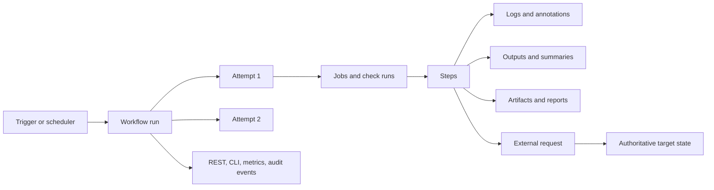

# Debugging and operating GitHub Actions

> Advanced course · reviewed against current platform guidance on 2026-09-27 ·
> workflow-native incident lab with deterministic failure injection

A failed job is an observation, not a diagnosis. A green rerun is evidence, not
proof that the problem disappeared. A timeout is not proof that an external
write failed. Reliable operations begin by preserving identity and state,
separating the first fault from later symptoms, classifying uncertainty, and
turning repeated runs into service-level evidence.

This final course treats a workflow as a production system: it has a control
plane, a queued execution graph, runner capacity, mutable dependencies, external
services, persistent effects, users, cost, and an incident lifecycle. The lab
uses GitHub Actions itself to create real attempts, checks, logs, summaries,
annotations, and artifacts while all external effects remain a safe local mock.

## Learning outcomes

After completing the chapter and lab, you can:

1. trace **workflow run → attempt → job/check run → step → log/summary/artifact →
   external state** without confusing identifiers or attempts;
2. distinguish trigger, queue, runner, dependency, deterministic, flaky,
   permission, policy, cancellation, external-transient, and uncertain-write
   failures from evidence;
3. preserve a true failing conclusion while still collecting structured incident
   evidence with `always()`, artifacts, summaries, and annotations;
4. use the GitHub UI, `gh run`, REST endpoints, Checks API concepts, Actions
   metrics, audit evidence, and runner diagnostics for their appropriate scope;
5. calculate schedule delivery, terminal success, queue and duration percentiles,
   critical path, flake-candidate rate, retry amplification, runner minutes, and
   error-budget burn from exported data;
6. decide when to reproduce, rerun, reconcile, retry, quarantine, roll back,
   escalate, or stop;
7. reconstruct a cross-system incident timeline and identify missing evidence;
8. define SLOs, retention, notification deduplication, runner monitoring, cost
   controls, and an operational ownership model; and
9. add a regression test for the cause before restoring automation.

## Prerequisites, scenario, and boundaries

Complete [Security and reliability](../01-security-and-reliability/README.md),
[Deployment patterns](../../intermediate/02-deployment-patterns/README.md), and
[Workflow design](../../intermediate/01-workflow-design/README.md). You should
understand job DAGs, permissions, artifacts, concurrency, idempotency, and trust
boundaries.

**Scenario.** Northstar runs weekly entitlement reconciliation. Operators report
four symptoms: a deterministic bad plan, an intermittent test that passes on a
rerun, a provider connection reset before a write, and a response lost after the
provider already applied the write. Scheduled runs may queue late, and a manual
rerun can overlap. The team needs one evidence path that does not turn every
failure into a duplicate issue or a blind retry.

**Success criteria.** You will run five controlled failure modes, retain evidence
before enforcing the conclusion, reconcile ambiguous writes, prove that only a
known pre-write absence is retried, observe a flaky candidate across run
attempts, calculate eleven operational signals from ten historical attempts,
reconstruct a nine-event incident timeline, and expose one fail-closed required
operations check.

**Non-goals.** The lab does not contact a real provider, create repository
issues, page an on-call engineer, cancel other runs, access secrets, or claim
that a synthetic dataset represents a production SLO. It does not make a local
emulator equivalent to GitHub-hosted execution.

**Safety boundary.** Use a fork or disposable practice repository. The runnable
workflow is read-only, credential-free, and GitHub-hosted. Failure injection
changes only files inside the runner workspace. Do not add production endpoints,
write permissions, secrets, OIDC, self-hosted runner labels, or real notification
destinations. Files under `fixtures/` end in `.yml.txt` and are review-only.

## Mental model: an evidence graph, not a log stream

The visible error line is one node in a larger graph:



An investigation should preserve six identities:

- **definition:** workflow path, workflow ref, action SHAs, reusable workflow
  chain, and repository settings in force;
- **source:** head SHA, ref, event payload, actor and stable actor ID;
- **execution:** run ID, run number, run attempt, job/check-run IDs, runner image
  or runner group, and timestamps;
- **input:** typed dispatch input, matrix cell, dependency/lockfile identity,
  artifact ID and digest, environment and configuration version;
- **effect:** idempotency key, external transaction/deployment ID, target before
  and after state, and reconciliation response; and
- **evidence:** logs, summaries, annotations, reports, artifacts, metrics, audit
  events, incident notes, owners, and retention.

Logs are ordered text from one process. They may be incomplete, redacted, noisy,
expired, or split across attempts. The source of truth for an external mutation
is normally the external system, not the runner's last line.

## Foundations: status, conclusion, and attempt

### Status is progress; conclusion is terminal meaning

A run or job moves through states such as queued and in progress before it has a
conclusion. Terminal conclusions include success, failure, cancelled, skipped,
neutral, stale, startup failure, and timed out in relevant interfaces. Do not
collapse all non-success states into “failed”:

- **skipped** may be an intentional event-specific path or an accidental `needs`
  cascade;
- **cancelled** may indicate operator action, concurrency replacement, policy,
  or a timeout at another layer;
- **startup failure** points toward configuration, billing, runner, or platform
  setup rather than the command under test;
- **timed out** bounds observation, not external state; and
- **neutral** can be expected for an advisory check but is usually unsuitable
  for a required enforcement gate without explicit policy.

GitHub Actions creates a check suite for a workflow run and a check run for each
job; jobs contain steps. The [workflow log reference](https://docs.github.com/en/actions/how-tos/monitor-workflows/use-workflow-run-logs)
describes this Checks API relationship and the synthetic “Set up job” and
“Complete job” steps.

### A rerun is a new attempt of the same run

`GITHUB_RUN_ID` remains associated with the run; `GITHUB_RUN_ATTEMPT` identifies
the execution attempt. Job IDs and logs can differ. Artifact names that omit the
attempt may collide or obscure provenance. The jobs REST endpoint defaults to
the latest execution, while `filter=all` includes jobs from old attempts. A
partially rerun workflow's downloaded log archive may contain only jobs from the
rerun, so retrieve earlier attempts when reconstructing the full history.

A pass on attempt two with the same source SHA is a **flake candidate**. It is
not automatically a flaky test: external recovery, runner image drift, cache
state, changed secrets/settings, rate-limit reset, or nondeterministic ordering
can produce the same observation. Preserve both attempts and classify the cause.

## A systematic investigation method

### 1. Establish run identity before reading the error

Record workflow, event, actor, source SHA/ref, workflow ref, run ID/number/
attempt, dispatch inputs, environment, runner, and relevant settings. Confirm
the workflow revision that GitHub actually evaluated; inspecting the current
default branch can show code that did not run.

Useful read-only commands include:

```bash
gh run list --workflow WORKFLOW --limit 20 \
  --json databaseId,attempt,event,headSha,status,conclusion,createdAt,startedAt,updatedAt,url
gh run view RUN_ID --attempt ATTEMPT --verbose
gh run view RUN_ID --attempt ATTEMPT --log-failed
gh run download RUN_ID --dir evidence/RUN_ID
```

The [GitHub CLI run manual](https://cli.github.com/manual/gh_run) documents list,
view, watch, rerun, cancel, and artifact-download operations. Prefer structured
JSON to scraping formatted terminal output.

### 2. Decide whether the workflow should have existed

If no run appears, inspect workflow syntax, default-branch presence, event and
activity type, branch/path filters, commit skip markers, policy restrictions,
disabled state, and schedule rules. Scheduled workflows run from the default
branch and can be delayed or even dropped during high load; GitHub recommends
avoiding the start of the hour. Public-repository schedules may be disabled
after inactivity. A scheduler SLO therefore needs expected slots, not only the
runs that happened. See [Events that trigger workflows](https://docs.github.com/en/actions/reference/workflows-and-actions/events-that-trigger-workflows).

### 3. Find the first divergent node

Start at the graph, not the final cascade:

1. Which job was first to fail, cancel, wait, or skip unexpectedly?
2. Did its prerequisites complete with the expected conclusions and outputs?
3. Which step first diverged from its normal state?
4. Did a timeout or cancellation interrupt cleanup or evidence upload?
5. Did `if`, `needs`, matrix expansion, concurrency, environment approval, or
   permission evaluation explain the state before the command ran?

An evidence job with `needs: operate` and no `if: always()` is skipped precisely
when `operate` fails. A final job with `always()` that never inspects `needs`
can create a false-green gate. The reference solution demonstrates both evidence
collection and explicit conclusion enforcement.

### 4. Reconstruct the execution environment

Inspect the “Set up job” output for runner image, included software link, OS and
architecture. Record language/runtime, lockfile, shell, working directory,
locale/timezone, environment variables by name—not value—and action SHAs. For
self-hosted runners add runner ID/name/group/labels, image version, autoscaler
decision, node lifecycle, network, disk pressure, and `_diag` logs.

`ubuntu-latest` intentionally moves. It is useful for continuous compatibility
testing but weak for isolating image drift. An explicit image such as
`ubuntu-24.04` narrows change while it is supported; a pinned container digest
or controlled runner image narrows it further but transfers patching and image
operations to you. Use a matrix if you need both reproducibility and early
warning of the next image.

### 5. Reproduce the smallest responsible layer

Re-run the exact command with the same source, runtime, lockfile, working
directory, shell, and relevant inputs. Do not begin by rewriting the workflow.
Use `actionlint` for workflow structure, ShellCheck for shell, language-native
tests for code, and a small practice repository for GitHub scheduling and
permission behavior. `act` can accelerate local command feedback, but runner
images, event payloads, services, permissions, OIDC, environments, artifacts,
and hosted networking differ; a local pass cannot certify GitHub behavior.

### 6. Classify before choosing recovery

| Class | Evidence | Safe next move |
| --- | --- | --- |
| Deterministic code/config | Same source/input fails identically; clear invariant violation | Fix smallest layer; add regression test; do not rerun blindly |
| Flake candidate | Same source passes on later attempt without code change | Preserve attempts; isolate nondeterminism; quarantine only with owner/expiry |
| External transient | Rate limit, unavailable service, connection failure with known write state | Bounded backoff within deadline; respect provider retry guidance |
| Uncertain write | Client did not receive a definitive response | Query authoritative state using same operation identity before retry |
| Permission/policy | 403, missing token scope, environment/ruleset wait, event restriction | Correct the narrow authority or intended policy; do not grant blanket write |
| Queue/capacity | Large created→started gap, unmatched runner labels, scale lag | Inspect metrics, runner inventory/autoscaler, concurrency and budgets |
| Cancellation | Actor, concurrency, timeout, superseding run, or shutdown evidence | Determine initiator and partial-effect risk; reconcile before restart |
| Supply-chain/runner drift | Action/tool/image changed; setup log differs | Compare immutable identities; pin/roll back; inspect advisories and image notes |
| Missing schedule | Expected slot has no run | Check default branch, disablement, policy and platform delay/drop; use external scheduler if guarantee is required |

Classification is a hypothesis with confidence and evidence. “Unknown” is valid
when the evidence cannot distinguish causes; the correct response is to preserve
state and reduce uncertainty, not invent certainty.

## Instrumentation mechanics

### Logs: diagnostic detail with deliberate scope

Name steps by intent and include stable reason codes. Group verbose but safe
detail. Never dump complete contexts or environments; they can contain tokens,
URLs, claims, branch names, user content, and other sensitive data. Transfer
untrusted values through environment variables and sanitize values used in
workflow commands.

Enable step or runner debug logging only for the required rerun and disable it
afterward. Runner diagnostic logging adds runner and worker logs to the archive.
It increases evidence but may increase sensitive operational detail and storage.
GitHub documents `ACTIONS_STEP_DEBUG`, `ACTIONS_RUNNER_DEBUG`, and debug reruns in
[Enabling debug logging](https://docs.github.com/en/actions/how-tos/monitor-workflows/enable-debug-logging).

### Job summaries and annotations: navigation, not retention

Write a concise Markdown decision to `$GITHUB_STEP_SUMMARY`: run identity,
classification, reason code, reconciliation, artifact link/name, and next owner.
Use `::error`, `::warning`, or `::notice` for actionable, bounded annotations.
GitHub limits annotations per step and line association can be imperfect, so a
summary should point to retained evidence rather than reproduce every log.
Workflow commands and environment files are documented in the [workflow command
reference](https://docs.github.com/en/actions/reference/workflows-and-actions/workflow-commands).

### Artifacts: structured evidence with provenance and expiry

Retain machine-readable reports, test results, traces, manifests, and timelines;
exclude credentials and unnecessary personal data. Include run ID and attempt in
the artifact name. Record artifact ID, service-computed digest, size, creation,
expiry, source run and source SHA. An artifact is not immutable long-term storage
and can expire or be deleted. The [Artifacts REST API](https://docs.github.com/en/rest/actions/artifacts)
exposes these fields and requires Actions read permission for private resources.

### APIs, webhooks, metrics, and audit evidence

- **Workflow Runs REST API:** enumerate runs, attempts, conclusions, timestamps,
  logs, reruns, and cancellation. Paginate and store stable IDs.
- **Workflow Jobs REST API:** retrieve jobs and steps; use `filter=all` to include
  prior attempts. See [Workflow jobs endpoints](https://docs.github.com/en/rest/actions/workflow-jobs).
- **Checks API:** maps suites/check runs to commits and exposes output and
  annotations. Creating check runs requires a GitHub App; Actions creates its
  own job check runs. See [Check runs endpoints](https://docs.github.com/en/rest/checks/runs).
- **`workflow_run` and `workflow_job` webhooks:** event-driven export for run and
  job lifecycle; webhook delivery itself needs retry, deduplication, signatures,
  ordering tolerance, and reconciliation.
- **Actions metrics:** repository and organization views expose usage and
  performance such as minutes, volume, runtime, queue time, and failures. GitHub
  notes aggregation and counting caveats; define your denominator explicitly.
- **Audit log:** supports actor and control-plane investigation. Organization
  events such as created/prepared/rejected workflow jobs may include run IDs,
  runner metadata, workflow refs and names of secrets passed—not secret values.
  Access and retention vary by product and export method.

No one source is complete. Join on stable IDs and timestamps, retain the raw
input used for a calculation, and handle missing, delayed, duplicated, and
out-of-order events.

## Reliability and efficiency metrics

Define the population first: workflow, event, branch, repository set, time
window, attempts versus logical runs, and whether skipped/cancelled runs count.
Then calculate:

### Schedule delivery

```text
schedule delivery = observed scheduled slots / expected scheduled slots
```

Counting only existing runs makes missing schedules invisible. The lab observes
9 of 12 expected slots, so delivery is `0.75`.

### Terminal success and first-attempt success

```text
terminal success = successful attempts / terminal attempts
first-attempt success = logical runs successful on attempt 1 / logical runs
```

The lab has 7 successes among 10 terminal attempts: `0.70`. This alone mixes
service health, flaky reruns, cancellations, and operator behavior; keep
dimensions separate.

### Queue and execution latency

```text
queue time = started_at - created_at
execution time = completed_at - started_at
end-to-end time = completed_at - created_at
```

Prefer percentiles over averages. The fixture uses nearest-rank p95: queue p95
is 600 seconds and duration p95 is 1,200 seconds. Segment by runner type, label,
event and repository before blaming workflow code.

### Critical path and runner consumption

For each job `j` with duration `d(j)` and dependencies `needs(j)`:

```text
CP(j) = d(j) + max(CP(parent) for parent in needs(j))
workflow critical path = max(CP(j))
```

Critical path approximates compute-limited wall time; queueing, approvals,
concurrency waits and artifact transfer add observed latency. Runner consumption
is the sum of job execution time, so parallelism can reduce wall time while
increasing simultaneous capacity and leaving total minutes similar.

### Flake candidates and retry amplification

```text
flake-candidate rate = initially failed logical runs that pass unchanged / initially failed logical runs
retry amplification = workflow attempts / logical workflow runs
```

The fixture has one unchanged recovery among three initially unsuccessful
logical runs (`1/3`) and 10 attempts for 9 logical runs (`1.11`). Investigate
causes before calling the test flaky.

### Error-budget burn

For a terminal-success objective `SLO` over `N` attempts:

```text
allowed bad = N × (1 - SLO)
burn = observed bad / allowed bad
```

At a 90% objective and 10 terminal attempts, one bad attempt is allowed; three
consume three times the window budget. Small populations make percentages
volatile, so combine the signal with minimum sample sizes and incident review.

## Architecture patterns and trade-offs

| Pattern | Best fit | Strength | Limitation |
| --- | --- | --- | --- |
| In-workflow summary + artifact | Repository-owned CI and compact evidence | Immediate, low integration cost | Tied to run retention and GitHub availability |
| Stable final gate | Required checks across conditional jobs | Prevents false green or missing evidence | Must encode every acceptable skipped/cancelled state |
| `workflow_run` exporter | Post-run collection in GitHub | Separates telemetry from application workflow | Treat producer artifacts as untrusted; event may need reconciliation |
| GitHub App + webhooks | Cross-repository event pipeline | Near-real-time lifecycle and check access | App permissions, webhook delivery, storage and on-call ownership |
| Periodic REST collector | Backfill and SLI computation | Simple reconciliation and missed-event recovery | API limits, pagination, latency and duplicate handling |
| Native Actions metrics | Interactive usage/performance analysis | Low setup; workflow/job/runner views | Product aggregation and export windows may not match your SLO |
| External observability platform | Organization-wide dashboards and alerting | Correlation with services/deployments and longer retention | Cost, schema governance, credentials, privacy and vendor coupling |
| Runner telemetry/ARC metrics | Self-hosted capacity and queue diagnosis | Connects scale, pod/node and job lifecycle | Does not explain application-step failures by itself |

Use an event-driven collector plus periodic reconciliation when completeness
matters. Keep the raw GitHub identifiers and source timestamps so a derived
metric can be recomputed after a schema or policy change.

## Tool landscape

| Tool | Primary use | Production note |
| --- | --- | --- |
| GitHub Actions UI | Graph, steps, logs, reruns, timing, artifacts | Best first view; not bulk analysis |
| `gh run` / `gh pr checks` | Scriptable operator investigation | Use JSON fields and explicit attempt; pin CLI in automation |
| Actions REST API | Runs, jobs, attempts, logs, artifacts, usage operations | Version headers, pagination, rate limits, permission scope |
| Checks API | Check suites/runs, conclusions, annotations | Write operations require a GitHub App |
| Actions metrics | Usage and performance trends | Validate aggregation, population, timezone and export window |
| Job summaries / annotations | Human-readable decisions and code-linked findings | Bounded navigation layer, not durable telemetry |
| JUnit/coverage/test reporters | Test-level evidence and annotations | Pin actions; sanitize test names/output; retain raw report |
| `actionlint`, ShellCheck, language tests | Pre-run static and local diagnosis | Cannot model every event, permission or hosted service |
| `act` | Fast local workflow-command feedback | Not parity for GitHub runners, identity, policy or hosted services |
| OpenTelemetry/vendor exporters | Correlate CI with deployment/service signals | Define stable schema, sampling, secrets and failure isolation |
| ARC / runner scale-set telemetry | Queue and self-hosted capacity operations | Forward ephemeral runner logs before deletion |

## State of the art as of 2026-09-27

**Established practice.** Structured logs, immutable workflow/action identity,
attempt-aware artifacts, targeted debug reruns, stable required checks, explicit
failure taxonomy, bounded retry with reconciliation, queue/duration/success
metrics, and incident regression tests remain the foundation.

**Current platform capability.** GitHub provides repository and organization
Actions usage and performance metrics, including workflow/job minutes, average
runtime, average queue time, and failures. `gh run` supports structured run
fields, attempts, failed logs, watching, and partial reruns. Scheduled workflows
support IANA timezones but remain subject to default-branch and load caveats.
Workflow-run/job APIs, Checks API output, job summaries, artifact digests,
webhooks, audit events, and debug-rerun controls provide complementary evidence.

**Maturing operations.** Runner scale sets and Actions Runner Controller are the
recommended Kubernetes path for autoscaled self-hosted runners; GitHub also
documents a Scale Set Client for custom platforms. Ephemeral runner diagnostic
logs must be forwarded before deletion. More organizations export lifecycle
events into central observability systems and join CI metrics with deployment,
change and service reliability signals.

**Assisted diagnosis.** GitHub can offer automated explanations for some failed
runs. Treat any generated diagnosis as a hypothesis: verify the referenced
attempt, first failing step, workflow revision, permissions, and external state
before applying a fix or rerun.

**Open problems.** Logs and artifacts expire; distributed clocks differ; webhook
delivery can be delayed, duplicated, or absent; partially rerun jobs fragment
evidence; cancellation may interrupt cleanup; metrics can hide missing schedules
or conflate attempts; self-hosted runner capacity couples queueing to cluster
health; and no platform-only signal can prove whether an external side effect
occurred. Operational systems must tolerate incomplete evidence.

## Worked scenario: an ambiguous maintenance timeout

Before reading the workflow, trace the expected sequence:

1. A schedule or operator creates a workflow run. The job records run/attempt,
   source SHA, workflow ref, event and actor ID in the summary.
2. The maintenance command uses an idempotency key derived from the run ID. In
   `transient-after-write` mode, the mock target records the operation, then the
   client observes a lost response and exits with a temporary-failure code.
3. `continue-on-error` lets the workflow collect evidence; it does not decide
   success. The next step queries target state by the same key.
4. Reconciliation returns `applied`, so no retry occurs. Classification sets the
   terminal operation state to success while preserving the initial external-
   transient failure evidence.
5. The report is uploaded before enforcement. A separate job downloads it,
   computes the historical SLIs and reconstructs incident INC-1042.
6. A stable gate verifies both operation and evidence analysis. In deterministic
   or first-attempt flaky mode, operation enforcement fails, analysis still runs,
   and the final gate stays red.
7. Rerunning the failed flaky attempt produces run attempt two with the same SHA.
   The fixture succeeds, creating the evidence needed to classify—not silently
   excuse—the flake candidate.

The workflow never opens an issue. A production notifier would deduplicate on a
stable incident key, update rather than spam, route by ownership/severity, include
evidence links, and avoid placing sensitive content in a broadly visible system.

## Failure modes and anti-patterns

| Anti-pattern | Operational harm | Better design |
| --- | --- | --- |
| Read only the last error | Diagnoses cascade rather than cause | Identify first divergent job/step and graph state |
| Dump `toJSON(github)` or `env` | Leaks sensitive or attacker-controlled data | Emit allowlisted metadata fields and reason codes |
| Add `continue-on-error` and stop | Makes failure advisory or false green | Capture evidence, classify, then explicitly enforce conclusion |
| Evidence job lacks `always()` | Skips evidence on upstream failure | `if: always() && !cancelled()` plus result inspection |
| Blindly rerun timeout | Can duplicate external side effect | Same idempotency key + authoritative reconciliation |
| Call a second-attempt pass “flaky” | Hides external or environment cause | Preserve attempts; compare all identities; investigate |
| One issue per failure | Alert storm and no incident continuity | Stable dedupe key, update state, route and resolve |
| Trust `ubuntu-latest` as static | Runner migration appears as random failure | Record image; explicit image and compatibility matrix |
| Measure only existing schedules | Dropped/disabled schedules appear healthy | Generate expected slots and compare observed runs |
| Average latency only | Tail queue/runtime pain is hidden | p50/p95/p99 plus segmented distributions |
| Count attempts as deployments | Reruns distort change reliability | Separate logical run, attempt and external operation IDs |
| Delete failed logs immediately | Destroys incident evidence | Policy-based retention, restricted access and legal/privacy review |

## Production operating model

### Instrumentation contract

Define a versioned schema with repository/workflow IDs, run ID/attempt, job ID,
source and workflow refs, event, actor ID, runner class, created/started/completed
times, conclusion, reason code, idempotency/external IDs, artifact identity, and
classification confidence. Do not export secret values, full contexts, arbitrary
user content, or unbounded logs.

### SLOs and alerts

Choose user-visible objectives: required CI evidence before merge, scheduled
reconciliation delivery, release lead time, queue p95, terminal success, and
recovery time. Define exclusions before an incident. Alert on sustained budget
burn, missing schedules, stuck queues, unavailable runner groups, repeated
startup failure, evidence loss, and unresolved external writes—not every red
step. Route alerts to an owning team and test delivery.

### Retention and access

Align logs, artifacts, audit exports, test reports and external telemetry with
debugging windows, security incident needs, privacy, compliance, legal hold, and
cost. Record expiry in the run summary. Restrict evidence that contains source,
user identifiers, internal endpoints or diagnostic detail. Test retrieval before
an incident and deletion when retention ends.

### Runner operations

For self-hosted capacity, monitor queued jobs by label/group, scale request to
runner-ready latency, registration/deregistration failures, pod/node health,
disk/network pressure, runner version drift and update failures. Forward
ephemeral `_diag` runner/worker logs externally. Use clean images, immutable
image identity, canary rollout, rollback, and capacity headroom. GitHub documents
ARC and scale-set behavior in the [self-hosted runner reference](https://docs.github.com/en/actions/reference/runners/self-hosted-runners).

### Incident response

1. Declare severity, owner, scope, communication channel and stable incident ID.
2. Stop unsafe new mutations; do not destroy evidence or blindly cancel a job
   whose external transaction state is unknown.
3. Preserve workflow definition/source, all attempts, logs, artifacts, check and
   audit metadata, runner/image identity, action SHAs and external records.
4. Revoke exposed credentials, quarantine runners, disable compromised actions,
   invalidate poisoned cache/artifact paths, and reconcile target state.
5. Build a UTC timeline separating observation, inference and confirmed fact.
6. Restore with the smallest safe fix, explicit validation and rollback plan.
7. Add a deterministic regression case, update SLO/alert/runbook gaps, assign
   follow-ups with owners and dates, and verify controls after restoration.

## Practical implementation

Follow the [guided workflow lab](exercises/README.md). Install the safe
[`01-incident-operations-starter.yml`](exercises/01-incident-operations-starter.yml),
capture baseline attempts, then compare with
[`01-evidence-led-operations.yml`](solutions/01-evidence-led-operations.yml).
The lesson-owned fixture uses only Node's standard library, requires no
credentials, and emits machine-readable operation, reconciliation, SLI and
timeline evidence.

## Review questions and extensions

1. Why can the final failing step be the least useful diagnostic signal?
2. Which IDs remain stable across a rerun, and which evidence must be retrieved
   per attempt?
3. A timeout occurs after a package publication request. What facts are required
   before retry?
4. Design an `always()` evidence job that does not turn cancelled or failed work
   green.
5. Why does a second-attempt pass establish only a flake candidate?
6. How would you generate expected schedule slots across daylight-saving changes?
7. Compare p95 queue latency by runner label before changing workflow code.
8. Design a webhook collector that tolerates duplicate and out-of-order events
   and backfills missed deliveries through REST.
9. Define a notification dedupe key and state machine for recurring maintenance
   failures.
10. Create a retention matrix for logs, artifacts, audit events, test reports and
    incident records, including owner and deletion verification.
11. Add a new fixture for a runner image migration and prove the diagnosis from
    image identity rather than timing coincidence.
12. Write a post-incident review that separates contributing conditions from the
    trigger and tracks whether the regression test would have detected it.

## Authoritative references

- GitHub Docs — [Using workflow run logs](https://docs.github.com/en/actions/how-tos/monitor-workflows/use-workflow-run-logs)
- GitHub Docs — [Troubleshooting workflows](https://docs.github.com/en/actions/how-tos/troubleshoot-workflows)
- GitHub Docs — [Enabling debug logging](https://docs.github.com/en/actions/how-tos/monitor-workflows/enable-debug-logging)
- GitHub Docs — [Workflow commands, summaries, and annotations](https://docs.github.com/en/actions/reference/workflows-and-actions/workflow-commands)
- GitHub Docs — [Events that trigger workflows](https://docs.github.com/en/actions/reference/workflows-and-actions/events-that-trigger-workflows)
- GitHub Docs — [Concurrency](https://docs.github.com/en/actions/concepts/workflows-and-actions/concurrency)
- GitHub Docs — [Actions metrics](https://docs.github.com/en/actions/concepts/metrics)
- GitHub Docs — [Viewing Actions metrics](https://docs.github.com/en/actions/how-tos/administer/view-metrics)
- GitHub Docs — [Workflow runs REST API](https://docs.github.com/en/rest/actions/workflow-runs)
- GitHub Docs — [Workflow jobs REST API](https://docs.github.com/en/rest/actions/workflow-jobs)
- GitHub Docs — [Artifacts REST API](https://docs.github.com/en/rest/actions/artifacts)
- GitHub Docs — [Check runs REST API](https://docs.github.com/en/rest/checks/runs)
- GitHub Docs — [Audit log events](https://docs.github.com/en/organizations/keeping-your-organization-secure/managing-security-settings-for-your-organization/audit-log-events-for-your-organization)
- GitHub Docs — [Self-hosted runners reference](https://docs.github.com/en/actions/reference/runners/self-hosted-runners)
- GitHub CLI — [`gh run` manual](https://cli.github.com/manual/gh_run)

You have now completed the core GitHub Actions learning path. Return to the
[curriculum map](../../README.md), review the six course checkpoints, and use the
[full knowledge check](../../../quiz/) to identify topics that need another lab
run or design review.
