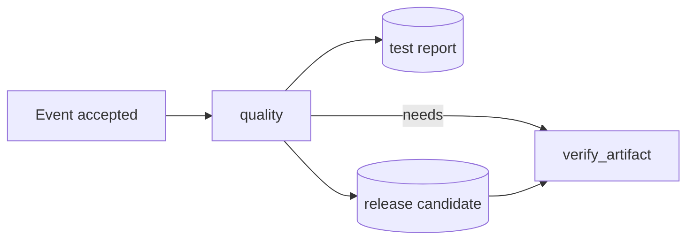

# GitHub Actions foundations: from repository event to trustworthy evidence

GitHub Actions is GitHub's workflow automation platform. A workflow is not merely a YAML file that runs commands: it is an event-driven program with a selected revision, a permission boundary, a dependency graph, ephemeral compute, data-transfer channels, observable results, and potentially expensive or privileged side effects.

This lesson builds that system model before introducing advanced syntax.

## Course orientation

### Learning outcomes

By the end of this lesson, you can:

1. trace an event through workflow selection, job scheduling, runner preparation, step execution, and check results;
2. explain which commit, ref, actor, token, and event payload a run receives;
3. derive job execution waves from `needs` dependencies and detect a broken dependency graph;
4. choose among step outputs, job outputs, artifacts, caches, variables, secrets, and external storage;
5. distinguish trusted branch code from untrusted pull-request code without relying on contributor claims;
6. run a realistic Node.js CI path locally and inspect its test report and build manifest;
7. evolve a single-job starter into a bounded, observable two-job workflow;
8. inject test, artifact-handoff, trigger, and cancellation failures in real workflow runs; and
9. select common GitHub Actions tools based on what they actually validate.

### Prerequisites and estimated effort

- A GitHub account and basic Git/command-line familiarity.
- Node.js 22+ and npm for the sample service.
- A practice branch or fork for the workflow labs; GitHub CLI is optional.
- About 90 minutes for reading and 60–90 minutes for the workflow lab.

No GitHub token, cloud account, API key, or paid service is needed. The default path is local and credential-free.

### Scenario

Northstar Software maintains an enterprise subscription-renewal service. A small policy module calculates loyalty and enterprise discounts. A wrong change could overcharge customers, grant an excessive discount, or silently accept an unsupported account tier.

The team needs pull-request CI that:

- installs exactly from a lockfile;
- executes positive and boundary tests;
- writes a diagnostic test report even when tests fail;
- builds a release candidate with a SHA-256 manifest;
- transfers that candidate to a second, isolated job;
- verifies the artifact without relying on the producer's workspace;
- runs fork contributions without write permissions or cache-write access; and
- cancels a stale run when a newer commit supersedes it.

The lesson-owned [`sample-app/`](sample-app/), [workflow starter](exercises/01-foundations-starter.yml), and [reference solution](solutions/01-hardened-ci.yml) implement this scenario.

### Success criteria

You are done when you can explain one successful and one intentionally failed workflow run, retain the expected diagnostics, verify the build artifact on a fresh runner, and justify the workflow's event, revision, permissions, concurrency, and state-transfer choices.

### Non-goals and risk boundaries

This lesson does not deploy, publish, mutate repository settings, or use production credentials. The workflow lab intentionally runs on GitHub so learners observe the real scheduler, runner isolation, logs, checks, and artifacts rather than a local simulation.

Do not copy the educational major action tags unchanged into a high-assurance production workflow. Review the action source and pin the approved full commit SHA. Never add secrets to make fork pull-request tests “work.”

## Why this matters

A green check is only meaningful if you know what was tested, which revision supplied the workflow, what permissions the runner had, what state crossed job boundaries, and what evidence survived the run.

Many workflow failures come from an incorrect mental model:

- assuming a later job inherits the previous job's filesystem;
- confusing a dependency cache with an immutable build artifact;
- testing a pull-request merge result while believing the contributor head was tested;
- granting write permissions globally because one future job might publish;
- retrying an uncertain external write as if it were a failed read;
- using `pull_request_target` to run fork code with base-repository privileges; or
- treating local emulation as proof of GitHub-hosted behavior.

The foundational skill is therefore not memorizing YAML keys. It is reasoning about identity, trust, scheduling, state, and evidence.

## Mental model


<sub>Editable diagram source: [Mermaid](assets/actions-flow.mmd).</sub>

```text
event
  ↓ match `on`
workflow run (event payload + ref + SHA + actor + token policy)
  ↓ evaluate jobs, conditions, dependencies, concurrency
job
  ↓ allocate one runner and prepare scoped credentials
ordered steps
  ↓ shell commands or reusable actions
checks + logs + outputs + artifacts + deployments
```

The workflow lab exposes the same progression as `event -> workflow -> job -> runner -> step -> result` through the run graph, checks, logs, summaries, and retained artifacts.

## Foundations and terminology

### Event and trigger

An event is repository or external activity with an associated payload. A workflow's `on` configuration decides whether that event makes the workflow eligible to run. Common events include `push`, `pull_request`, `workflow_dispatch`, `schedule`, `release`, `workflow_call`, and `workflow_run`.

Filters reduce cost and noise, but they also affect correctness. If a required path is omitted, a branch-protection check can remain pending or never run. Some events require the workflow file to exist on the default branch. The [events reference](https://docs.github.com/en/actions/reference/events-that-trigger-workflows) is the source of truth for payloads, activity types, default-branch requirements, `GITHUB_SHA`, and `GITHUB_REF` behavior.

### Workflow and workflow run

A workflow is the versioned YAML definition under `.github/workflows/`. A workflow run is one evaluation of that definition for a specific event. GitHub locates workflow files at the event's associated ref or SHA, matches triggers, and creates a run with a unique run ID and attempt number.

Those identities solve different problems:

| Identity | Meaning | Good use |
| --- | --- | --- |
| `github.sha` | Revision associated with the event | Bind test evidence or artifacts to code |
| `github.ref` | Fully qualified event ref | Branch/tag conditions and concurrency |
| `github.run_id` | Stable ID for one workflow run | Logs, APIs, unique diagnostic names |
| `github.run_attempt` | Rerun number for the same run | Avoid collisions between attempts |
| `github.actor` | Account that initiated the run | Audit context, not authorization by itself |
| workflow revision | YAML used for this run | Reconstruct what automation actually executed |

For `pull_request`, the default SHA typically represents the pull request's merge result; the contributor head is available separately in the event payload. Testing the merge result asks “will this integrate with the base?” Testing the head asks “what exactly did the contributor submit?” High-value pipelines often need to state this choice explicitly rather than assuming the two revisions are interchangeable.

### Job and dependency graph

A job is one schedulable unit that runs on one runner. Jobs without dependencies can run concurrently. `needs` adds directed edges:



The graph must be acyclic and every dependency must name a real job. In the lesson workflow:

```text
wave 1: quality
wave 2: verify_artifact
```

The second job starts only if `quality` succeeds. It receives a fresh runner and downloads the named artifact; it does not inherit the source checkout, installed packages, or `dist/` directory.

### Runner

A runner is the machine that executes a job. GitHub-hosted runners are newly provisioned for the job and include a documented software image. Self-hosted runners are infrastructure you operate and may retain filesystem state, network reachability, or credentials unless deliberately isolated.

Runner choice changes more than speed:

- operating system, architecture, and preinstalled tools;
- network and private-resource access;
- isolation and persistence;
- startup and queue time;
- cost and billing model; and
- the blast radius of untrusted code.

Treat a self-hosted runner as privileged infrastructure. Do not place untrusted fork code on a persistent runner with access to production networks.

### Step and action

Steps run in order inside a job. A `run` step starts a shell process. A `uses` step invokes an action—a reusable JavaScript, Docker, or composite implementation. Both execute with the job's filesystem, environment, token, network access, and permissions.

An action reference is code selection. A mutable branch or tag can move after review. Readable major tags are useful in this lesson, while production workflows should pin a reviewed full commit SHA and use dependency automation to propose upgrades.

### Check suite, check run, logs, and summary

GitHub Actions reports workflow status through the Checks API. A workflow run creates a check suite and jobs appear as check runs with step logs. Run pages expose the dependency visualization, status, duration, annotations, artifacts, and rerun controls. GitHub CLI can inspect the same evidence, for example `gh run view RUN_ID --log-failed`.

Logs are diagnostic evidence, not an appropriate store for secrets or large build outputs. Step summaries provide human-readable Markdown for a run, while artifacts retain files under a configured policy.

## Internal mechanics

### 1. Revision and workflow selection

GitHub receives the event, identifies its ref/SHA, and searches `.github/workflows` at the applicable revision. A YAML file that does not exist at the revision cannot be selected. Invalid workflow syntax may prevent jobs from being created at all.

### 2. Context and expression evaluation

GitHub constructs contexts such as `github`, `runner`, `job`, `steps`, `needs`, `matrix`, `inputs`, `vars`, and `secrets`. Context availability depends on where an expression appears. Expressions are evaluated by GitHub, while `$NAME` or `%NAME%` is expanded later by the selected shell.

This boundary matters for security: event fields are untrusted data. Do not paste arbitrary titles, branch names, or issue bodies directly into a `run` script. Pass them through environment variables and quote them in the shell.

### 3. Permissions and token issuance

GitHub can issue a short-lived `GITHUB_TOKEN` for the run. The effective token scope comes from enterprise/organization/repository defaults, event restrictions, and workflow/job `permissions`. Start with an explicit read-only baseline and grant write scopes only on the job that performs the write.

Fork pull requests have additional protections. Do not work around them by switching to a privileged event and then executing the fork's code.

### 4. Scheduling and runner preparation

GitHub evaluates job conditions and `needs`, places eligible jobs in queues, assigns runners, prepares the workspace and token, and then executes steps. A job can be queued even though another independent job is already running. Concurrency rules may cancel or queue an older run before it completes.

### 5. Step execution and status propagation

Steps normally stop after a failure. Status functions such as `success()`, `failure()`, `cancelled()`, and `always()` change when a diagnostic or cleanup step runs. Diagnostic collection should not turn cancellation into a long-running workload or hide the primary failure.

The sample uses `if: ${{ !cancelled() }}` for test-report upload: it preserves diagnostics after a test failure but does not insist on work after cancellation.

### 6. Result retention

At job completion, GitHub records logs, outputs, annotations, artifacts, and deployment records. Retention and storage cost are operational decisions. Artifacts should be named with run or commit identity, should fail when required files are missing, and must never contain secrets.

## Data and state: choose the narrowest channel

| Mechanism | Scope/lifetime | Appropriate use | Failure or misuse |
| --- | --- | --- | --- |
| Environment variable | Current process/step, or configured job/workflow scope | Small runtime configuration | Not durable; easy to leak in logs |
| Step output | Later steps in the same job | A small computed value | Size limits; not a file channel |
| Job output | Jobs that declare `needs` | Small typed decision or identifier | Must be explicitly mapped; secret-like values may be redacted |
| Artifact | Jobs, people, or APIs within retention policy | Build packages, reports, provenance | Mutable naming assumptions; retention/storage cost |
| Cache | Future jobs/runs under cache scope | Reusable dependencies or build inputs | Stale/corrupted data; poisoning if low-trust code can write |
| Variable | Repository/org/environment configuration | Non-sensitive configuration | Visible to code; not a credential store |
| Secret | Scoped credential material | Token or key only when OIDC is unavailable | Exposure through command lines, logs, child processes |
| External store | Cross-run or long-lived state | Large datasets, registries, deployment state | Separate identity, authorization, consistency, and cost |

Current GitHub Actions supports `cache-mode` controls—`read`, `write`, `write-only`, and `none`—at workflow or job scope. The lesson workflow uses `read` so untrusted code cannot populate a cache consumed by a more privileged run. See the current [dependency caching reference](https://docs.github.com/en/actions/reference/workflows-and-actions/dependency-caching).

## Trust model

Code trust is derived from repository state and event metadata, not from text inside the contribution.

| Event path | Code under test | Default posture |
| --- | --- | --- |
| Protected `push` to `main` | Accepted repository revision | Trusted code, still least privilege |
| Same-repository `pull_request` | Proposed code | Reviewed/low trust until merged |
| Fork `pull_request` | External contributor code | Untrusted; no secrets or writes |
| `pull_request_target` | Base workflow with privileged context | Metadata-only unless a carefully isolated design proves otherwise |
| Manual/scheduled run | Default-branch workflow, operator/scheduler inputs | Validate inputs; protect side effects separately |

The event alone does not make commands safe. A fork can change test scripts, dependency hooks, Dockerfiles, compilers, and generated code. Installing or testing the contribution executes contributor-controlled behavior.

## Architecture patterns and trade-offs

| Pattern | Strengths | Limitations | Best fit |
| --- | --- | --- | --- |
| One job, sequential steps | Simple; fastest to understand; workspace shared | Cannot isolate permissions or runner types; no cross-job handoff practice | Small lint/test workflow |
| Multiple jobs with `needs` | Parallelism, permission isolation, clear gates | Repeated setup; explicit outputs/artifacts required | CI with distinct test/build/verify responsibilities |
| Reusable workflow | Packages jobs, runners, permissions, matrices, interfaces | Versioning and caller/callee permission complexity | Organization-standard pipelines |
| Composite action | Reuses a sequence of steps in the caller's job | Cannot own the job or runner | Repeated setup/tool logic |
| GitHub-hosted runner | Fresh environment, maintained images, simple scaling | Image drift, queue/cost constraints, limited private reach | Most public and standard CI |
| Ephemeral self-hosted runner | Private networking, hardware control, custom images | You own isolation, patching, scaling, cleanup, and incident response | Regulated/private workloads with mature platform operations |

For this beginner scenario, two GitHub-hosted jobs make the otherwise invisible job boundary concrete without introducing deployment credentials or external infrastructure.

## Technology landscape

No single tool proves a workflow is safe or correct. Use layers.

| Tool or service | What it does well | What it does not prove | Selection guidance |
| --- | --- | --- | --- |
| Official actions (`checkout`, `setup-node`, artifact/cache actions) | Common repository, runtime, artifact, and cache operations | Your event trust, business logic, or cloud policy | Prefer official or well-governed actions; review and pin |
| GitHub workflow editor and schema | Completion and basic syntax feedback | Shell correctness or security architecture | Useful first feedback, not a release gate |
| [`actionlint`](https://github.com/rhysd/actionlint) | Workflow syntax, expressions, contexts, action inputs, `needs`, ShellCheck/Pyflakes integration | Actual GitHub execution or organization settings | Strong local/CI static validation baseline |
| [`zizmor`](https://github.com/zizmorcore/zizmor) | Security-focused audits for GitHub Actions patterns | Complete application or cloud threat modeling | Add for workflow supply-chain security review |
| [GitHub CLI](https://cli.github.com/manual/gh_run) | List/watch/view/rerun runs, download logs/artifacts, API access | Local emulation | Use for operator workflows and evidence collection |
| [`act`](https://github.com/nektos/act) | Fast Docker-based local execution for supported workflows | Exact hosted images, every event/context, services, permissions, or GitHub-side controls | Optional feedback; always confirm important behavior on GitHub |
| Dependabot or Renovate | Proposes dependency/action updates | That an update is trustworthy or compatible | Pair with review, tests, and immutable pins |
| Runner image repositories | Show image contents and update history | Stability of `-latest` over time | Pin OS/runtime where reproducibility requires it |
| Actions Runner Controller | Kubernetes-based ephemeral runner scale sets | Secure cluster design by itself | Advanced platform teams needing elastic self-hosted capacity |

The lesson's workflow lab complements these tools: it produces real checks, logs, artifacts, cancellation behavior, and job isolation. Static tools and local emulators remain useful before pushing, but the GitHub run is the authoritative experiment.

## State of the art (verified 2026-09-20)

### Established practice

- Explicit least-privilege `permissions`, short-lived `GITHUB_TOKEN`, protected environments, concurrency, timeouts, lockfile installs, immutable artifacts, and job-scoped side effects.
- GitHub-hosted runners for most untrusted CI; isolated ephemeral self-hosted runners only when private access or specialized compute justifies the operational burden.
- Reusable workflows for organization-level job orchestration and composite actions for step reuse.
- Static validation, dependency automation, branch protection/rulesets, and observable run evidence as normal software-delivery controls.

### Current platform and ecosystem direction

- Current official JavaScript actions have moved to Node 24-based releases. As verified on 20 September 2026, the lesson uses the current readable v7 tags for `checkout`, `setup-node`, and `upload-artifact`, plus v8 for `download-artifact`; self-hosted runners must meet each action's documented minimum version.
- Cache access can now be constrained with `cache-mode`, including restore-only use on low-trust triggers. This makes cache authorization an explicit workflow design choice rather than only a convention.
- Artifact tooling increasingly exposes stable artifact IDs, digests, configurable retention, immutable names, and direct upload options. Artifacts are becoming traceable release inputs rather than incidental ZIP files.
- Artifact attestations connect build provenance to packages and container images. They complement—not replace—secure workflow design, trustworthy builders, and verification policy.
- Runner scale sets and Actions Runner Controller support elastic ephemeral self-hosted capacity, while organization policies and rulesets increasingly move controls above individual repositories.

### Emerging and open problems

- Safely composing reusable workflows across repositories while preserving least privilege, cache boundaries, secret contracts, and update governance.
- Reproducibility across moving runner images, package registries, external services, and mutable action references.
- Measuring workflow risk and supply-chain assurance without reducing complex trust decisions to one opaque score.
- Balancing fast feedback with cost, queue time, carbon/compute use, and redundant matrix coverage.
- Preventing artifact, cache, dependency, and runner persistence attacks across mixed-trust pipelines.

Treat version statements as a dated snapshot. Check each linked official repository and migration guide before upgrading production runners or actions.

## Worked scenario: Northstar renewal policy CI

The source change begins in [`sample-app/src/renewal-policy.mjs`](sample-app/src/renewal-policy.mjs). The test suite covers a long-term enterprise customer, a new standard customer, an unsupported tier, and an invalid price.

### Local path

```bash
cd curriculum/beginner/01-actions-foundations/sample-app
npm ci --ignore-scripts --no-audit --no-fund
npm run test:ci
npm run build
npm run verify:dist
```

The commands create two intentionally different outputs:

- `test-results/test-report.txt` is diagnostic evidence; and
- `dist/` is a release candidate containing source plus a manifest with a SHA-256 digest.

### Workflow path

1. `pull_request` or protected-branch `push` selects the workflow for relevant paths.
2. Explicit `contents: read` and `cache-mode: read` constrain the default job capabilities.
3. Concurrency groups the pull request or ref and cancels stale work.
4. `quality` gets a fresh runner, checks out the event revision without persisting credentials, installs Node 24, installs the lockfile, tests, and builds.
5. The diagnostic artifact is uploaded unless the run was cancelled.
6. The release candidate is named with `github.sha` and uploaded with a bounded retention period.
7. `verify_artifact` starts on a second runner with `permissions: {}`.
8. It downloads the exact named artifact and verifies the source digest against the manifest.

The second job deliberately does not check out the repository. This proves that its input is the artifact, not accidental workspace state.

## Guided implementation and experiments

Use the [guided workflow lab](exercises/README.md) as the primary practical work. Begin with [`01-foundations-starter.yml`](exercises/01-foundations-starter.yml), install it under `.github/workflows/` on a practice branch, and compare your completed design with [`01-hardened-ci.yml`](solutions/01-hardened-ci.yml) only after running both a success and a failure case.

### Experiment 1 — event and revision identity

Run the workflow once with `workflow_dispatch` and once from a pull request. Inspect the event, ref, SHA, actor, and checkout log. For a pull request, compare `github.sha` with the contributor branch head shown by GitHub.

Expected observation: event identity, selected revision, and contributor trust are related but separate facts.

### Experiment 2 — dependency scheduling and isolation

Complete the `verify_artifact` job with `needs: quality`. Do not check out the repository in that job. Inspect the run graph and verify that it succeeds using only the downloaded artifact.

Expected observation: `verify_artifact` starts only after `quality`, receives a fresh filesystem, and needs explicit artifact transfer.

### Experiment 3 — starter versus hardened controls

Diff the starter against your completed workflow. Account for permissions, timeouts, checkout credential persistence, concurrency, cache access, artifact identity, retention, and the isolated verification job.

Expected observation: every added control has a specific failure, trust, cost, or evidence purpose. The reference solution is not a security certification.

### Experiment 4 — failure injection

Temporarily break one expected value in the test suite and push the change. Confirm that the run fails, the first failed step identifies the regression, diagnostic output remains available, and the artifact-verification job is skipped. Revert the change afterward.

### Experiment 5 — superseded work

Push two quick commits to the same pull request after enabling concurrency. Confirm that the older run is cancelled and the newest revision remains authoritative. Do not use cancellation this way for a workflow performing non-reversible writes.

## Evaluation

The lesson separates four dimensions:

| Metric | Numerator | Denominator | Direction | What it tells you |
| --- | --- | --- | --- | --- |
| Expected-conclusion accuracy | Runs whose conclusion matches the injected scenario | All recorded lab runs | 100% | Success, failure, skip, and cancellation behavior matches the design |
| Diagnostic retention rate | Failed-test runs with a downloadable report | Failed-test runs expected to retain diagnostics | 100% | Failure evidence survives when it should |
| Artifact verification rate | Successful builds verified on a fresh runner | Successful builds | 100% | Cross-job state is explicit and integrity checked |
| Sample command pass rate | Local commands returning zero | Four CI-equivalent commands | 100% | The executable fixture matches the workflow path |

These metrics do not prove production security or performance. They provide concrete evidence from the learner's actual workflow runs instead of a simulated runtime.

## Failure modes and mitigations

| Failure | Observable evidence | Root question | Mitigation |
| --- | --- | --- | --- |
| Workflow never starts | No run or workflow-validation error | Did trigger/ref/path/default-branch selection match? | Validate syntax and event filters; use a test repository |
| Wrong revision tested | Logs and checkout SHA differ from intent | Merge result or contributor head? | Log safe revision metadata and make selection explicit |
| `npm ci` stops | Missing/stale lockfile or engine mismatch | Is dependency identity committed and compatible? | Commit/update the lockfile; pin runtime; do not fall back silently |
| Tests fail | First failed assertion plus retained report | Code regression or environment difference? | Reproduce locally; fix smallest responsible layer |
| Required artifact missing | Upload/download step fails | Did the producer create the declared path/name? | `if-no-files-found: error`; bind names to run/commit identity |
| Later job cannot see files | Fresh runner has no workspace | Was state transferred explicitly? | Use outputs/artifacts or repeat deterministic setup |
| Cache poisoning risk | Low-trust job can save shared cache | Who can write data restored by privileged code? | `cache-mode: read/none`; populate from hardened trusted workflows |
| Stale commits consume capacity | Multiple runs for one PR/ref | Is concurrency grouped by the resource? | Cancel stale CI; serialize side-effecting deployment instead |
| Mutable action changes | Same tag resolves to new code | What exact dependency was reviewed? | Pin full SHA; automate reviewed upgrades |
| Persistent runner contamination | Files/processes/network access survive | Is untrusted code isolated? | Prefer hosted or ephemeral runners; rebuild from known images |

### Anti-patterns

- Giving every job `contents: write` because one future job may publish.
- Uploading the entire workspace “for debugging,” including credentials or dependency caches.
- Using one fixed artifact name across matrix jobs or reruns.
- Treating a cache hit as correctness evidence.
- Running fork code in a privileged `pull_request_target` workflow.
- Adding `continue-on-error: true` to make a required check green.
- Retrying a release, migration, or payment after a timeout without reconciling external state.
- Assuming `act` reproduces every GitHub-hosted runner and GitHub-side control.

## When GitHub Actions is not the right execution plane

Consider another system or a hybrid design when you need very long-running compute, strict real-time scheduling, specialized distributed data processing, a hard air gap, large persistent workspaces, complex cross-repository orchestration beyond maintainable reusable contracts, or a deployment control plane with stronger transactional semantics than a workflow can provide.

GitHub Actions can still orchestrate an external system through a narrow authenticated API, but the external platform should own its durable state and safety invariants.

## Production upgrade path

| Teaching implementation | Production upgrade |
| --- | --- |
| Major action tags | Pin reviewed full commit SHAs; automate proposals and verify release provenance |
| One Node version on Ubuntu | Test the documented support matrix; pin runner/runtime where reproducibility requires it |
| Text diagnostic report | Publish structured test results, annotations, and a concise step summary |
| Local SHA-256 manifest | Sign or attest artifacts; verify identity and provenance before promotion |
| Read-only cache | Populate in a trusted workflow; scope keys and access; monitor storage and eviction |
| Two-job workflow | Separate validation, packaging, security scans, provenance, and deployment with job-level permissions |
| Repository controls in prose | Enforce rulesets, required checks/workflows, environment reviewers, and action allowlists |
| Hosted runner | Evaluate larger/private-network runners or ephemeral scale sets only with a threat model |
| Local scenario metrics | Add queue time, duration, failure category, flaky retry rate, artifact size, and cost telemetry |
| Manual dependency review | Use Dependabot/Renovate plus policy, compatibility tests, and code-owner review |

Production readiness also requires owners, SLOs, incident response, credential rotation, retention policy, cost budgets, change management, and a rollback path. YAML alone cannot supply those operating controls.

## Exercises

### Implementation

1. Add a test for an enterprise customer with one loyalty year and predict the exact quote before running it.
2. Add a `lint` job that can run in parallel with `quality`; confirm the execution graph in the Actions UI.
3. Add a small job output containing the build manifest version. Explain why the build files still belong in an artifact.

### Diagnosis

4. Delete `package-lock.json` in a temporary branch and identify the first failed workflow step.
5. Change the artifact name in the consumer only. Identify the first failing step and the evidence needed to fix it.
6. Introduce an invalid `needs` dependency in a temporary workflow copy and inspect the validation feedback before restoring the workflow.

### Architecture judgment

7. Decide whether a GPU-backed, persistent self-hosted runner is appropriate for fork pull requests. State the trust, network, cleanup, and cost assumptions.
8. Choose between one job and two jobs for a five-minute library test with no artifact. Justify the added or avoided complexity.
9. Design a trusted cache-population workflow without granting cache-write access to untrusted pull-request code.
10. Decide which evidence must be retained for 7, 30, and 365 days in a regulated release process, and identify the system of record for each.

## Review questions

1. Why is an artifact a better cross-job handoff than a cache for a release candidate?
2. What is the difference between the pull-request merge SHA and head SHA?
3. Why does a second job need its own setup even on the same operating system?
4. Which capability does `permissions: contents: read` constrain, and what does it not constrain?
5. Why is an action tag part of the supply-chain trust boundary?
6. When should stale runs be cancelled, and when should work be serialized instead?
7. What evidence distinguishes “tests failed” from “the runner never installed dependencies”?
8. Which lab evidence demonstrates correct behavior, and why is a successful run not a security certification?

## Summary

GitHub Actions turns an event and a versioned workflow into a dependency graph of isolated jobs. Each job receives a runner, scoped capabilities, ordered steps, and explicit channels for data and evidence. Correct workflow design begins with the event's trust boundary and selected revision, then narrows permissions, state transfer, concurrency, and retention. The sample pipeline makes those boundaries executable: it tests real policy code, retains failure evidence, creates an identifiable artifact, and verifies that artifact on a fresh runner.

Continue to [Workflow syntax](../02-workflow-syntax/README.md) to learn the YAML and expression rules that encode this model.

## References

### Official GitHub documentation

- [Workflows](https://docs.github.com/en/actions/concepts/workflows-and-actions/workflows)
- [Understanding GitHub Actions](https://docs.github.com/en/actions/get-started/understand-github-actions)
- [Events that trigger workflows](https://docs.github.com/en/actions/reference/events-that-trigger-workflows)
- [Workflow syntax](https://docs.github.com/en/actions/reference/workflows-and-actions/workflow-syntax)
- [Contexts reference](https://docs.github.com/en/actions/reference/accessing-contextual-information-about-workflow-runs)
- [Variables](https://docs.github.com/en/actions/how-tos/write-workflows/choose-what-workflows-do/store-information-in-variables)
- [Workflow artifacts](https://docs.github.com/en/actions/concepts/workflows-and-actions/workflow-artifacts)
- [Dependency caching reference](https://docs.github.com/en/actions/reference/workflows-and-actions/dependency-caching)
- [Jobs](https://docs.github.com/en/actions/how-tos/write-workflows/choose-what-workflows-do/use-jobs)
- [GitHub-hosted runners](https://docs.github.com/en/actions/concepts/runners/github-hosted-runners)
- [Self-hosted runners](https://docs.github.com/en/actions/concepts/runners/self-hosted-runners)
- [`GITHUB_TOKEN`](https://docs.github.com/en/actions/concepts/security/github_token)
- [Secure use reference](https://docs.github.com/en/actions/reference/security/secure-use)
- [Concurrency](https://docs.github.com/en/actions/how-tos/write-workflows/choose-when-workflows-run/control-workflow-concurrency)
- [Monitor workflows](https://docs.github.com/en/actions/how-tos/monitor-workflows)
- [Using workflow run logs](https://docs.github.com/en/actions/how-tos/monitor-workflows/use-workflow-run-logs)
- [Artifact attestations](https://docs.github.com/en/actions/concepts/security/artifact-attestations)
- [Actions Runner Controller](https://docs.github.com/en/actions/concepts/runners/actions-runner-controller)
- [Actions policies](https://docs.github.com/en/actions/concepts/security/actions-policies)
- [Billing and usage](https://docs.github.com/en/billing/concepts/product-billing/github-actions)

### Official action and tool repositories

- [`actions/checkout`](https://github.com/actions/checkout)
- [`actions/setup-node`](https://github.com/actions/setup-node)
- [`actions/upload-artifact`](https://github.com/actions/upload-artifact)
- [`actions/download-artifact`](https://github.com/actions/download-artifact)
- [`actions/cache`](https://github.com/actions/cache)
- [`actions/runner`](https://github.com/actions/runner)
- [GitHub CLI run commands](https://cli.github.com/manual/gh_run)
- [`actionlint`](https://github.com/rhysd/actionlint)
- [`zizmor`](https://github.com/zizmorcore/zizmor)
- [`act`](https://github.com/nektos/act)
