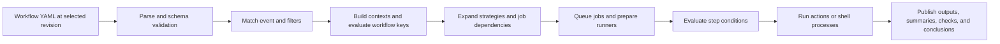
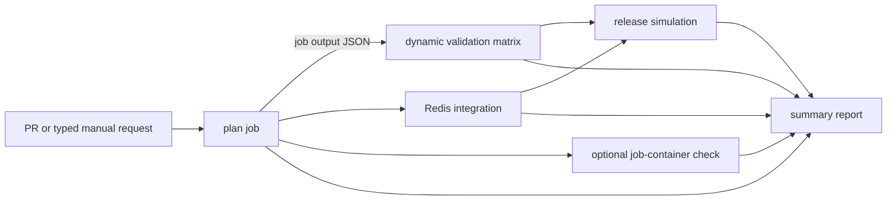

# GitHub Actions workflow syntax: from YAML document to evaluated run graph

A GitHub Actions workflow is an executable policy document. YAML supplies the
surface notation, but GitHub adds an event model, a typed expression language,
context-availability rules, permission semantics, job scheduling, runner and
container configuration, workflow commands, and failure propagation.

The practical skill is not memorizing keys. It is predicting what GitHub will
evaluate, when it will evaluate it, which values exist at that point, and what
jobs and steps the resulting graph will actually execute.

## Course orientation

### Learning outcomes

By the end of this lesson, you can:

1. map a workflow file from top-level keys to jobs, strategies, services, and steps;
2. author event triggers and filters while predicting ref, SHA, input, and default-branch behavior;
3. scope `GITHUB_TOKEN` permissions at workflow and job level;
4. select the correct context for event data, typed inputs, configuration, dependencies, matrix values, and step results;
5. reason about expression literals, coercion, truthiness, functions, and status checks;
6. transfer data through environment files, step outputs, job outputs, and `needs`;
7. generate and bound static or dynamic matrices;
8. configure job containers and service containers and explain their networking model;
9. control cancellation or queuing with concurrency groups;
10. validate workflows with GitHub, `actionlint`, ShellCheck, and focused run evidence; and
11. distinguish established workflow syntax from current additions and preview features.

### Prerequisites and estimated effort

- Complete [Actions foundations](../01-actions-foundations/README.md).
- Be comfortable with Git, JSON, a shell, and basic Node.js commands.
- Use a fork or disposable practice repository with GitHub Actions enabled.
- Allow about two hours for the chapter and two hours for the workflow lab.

The lab uses no production credentials and performs no external deployment.
Local fixture tests require Node.js 22 or newer. GitHub-hosted exercises consume
ordinary Actions minutes and pull a public Redis container image.

### Scenario

Northstar Software has three deployable components: `api`, `worker`, and `web`.
A release operator selects `staging` or `production`, supplies a JSON component
list, and chooses whether the request is a dry run. The workflow must:

- validate typed and structured input without shell injection;
- build a bounded component/runtime matrix;
- expose step values as job outputs;
- exclude an unsupported combination and mark one combination experimental;
- validate a Redis service dependency;
- optionally run the fixture inside a Node job container;
- distinguish pull-request validation from a manual release request;
- serialize requests for the same target instead of canceling active work;
- retain a concise job summary; and
- simulate release eligibility without a credential or external write.

The runnable [fixture](release-fixture/), [starter workflow](exercises/01-release-orchestration-starter.yml), [guided lab](exercises/README.md), and [reference solution](solutions/01-release-orchestration.yml) implement this scenario.

### Success criteria

You are finished when you can predict the expanded graph and conclusion of nine
labeled scenarios, obtain matching run evidence, diagnose each deliberately
broken fixture, explain every skipped job, and justify each permission,
dependency, condition, concurrency key, and data-transfer boundary.

### Non-goals and risk boundaries

This lesson does not teach production deployment, cloud identity, advanced
reusable-workflow API design, or organization-wide policy. Those subjects appear
in later courses. The release step is a simulation with `permissions: {}`.

Do not add secrets or a real deployment command. Do not test intentionally
unsafe interpolation in a repository that contains valuable credentials.

## Why syntax is an execution concern

A generic YAML parser can tell you whether indentation and scalar syntax are
valid. It cannot prove that:

- the event exists or supplies the context property you referenced;
- a job output is available without a `needs` edge;
- a string such as `"false"` behaves like the Boolean `false`;
- a matrix expands to the job count you expect;
- a shell receives untrusted event text as data rather than source code;
- a skipped dependency suppresses downstream work;
- a service port is reachable from the runner or a job container;
- a concurrency group cancels, replaces, or queues a run as intended; or
- token permissions and environment controls match the side effect.

Syntax therefore has three layers:

```text
YAML parse
  → GitHub workflow schema and context validation
    → event-specific expression evaluation and graph execution
```

A workflow must be correct at all three layers.

## Mental model: evaluation happens in phases



Values do not all exist at once. `github` and `inputs` can help name a workflow
run before any job exists. `matrix` appears only after strategy expansion.
`steps` values appear after the referenced step runs. `needs` exposes only
declared job dependencies. A later shell cannot repair an invalid expression
that prevented the job graph from being created.

## The YAML document and workflow identity

Traditional workflows are `.yml` or `.yaml` files under `.github/workflows/`.
The top-level shape is:

```yaml
name: Human-readable workflow name
run-name: Request for ${{ github.ref_name }} by @${{ github.actor }}

on: ...
permissions: ...
concurrency: ...
defaults: ...
env: ...

jobs:
  job_id:
    runs-on: ubuntu-latest
    steps: []
```

`name` identifies the workflow. `run-name` identifies one run and may reference
the `github` and `inputs` contexts. Job IDs and step IDs are machine-readable
interfaces; display names are labels. `needs`, output expressions, APIs, and
branch-protection checks depend on stable IDs and names, so rename deliberately.

YAML has its own hazards:

- indentation changes structure;
- tabs are not indentation;
- `*`, `!`, and `[` begin special syntax and often require quoting in filters;
- plain scalars may be interpreted differently by YAML libraries;
- duplicate mapping keys can silently overwrite in some parsers; and
- a YAML 1.1 library may treat `on` as a Boolean even though GitHub treats it as
  the workflow trigger key.

Use a GitHub-aware validator. A generic parser is a useful first layer, not the
authority for the Actions schema.

## `on`

`on` declares eligible events. It does not guarantee that a job will run; event
filters, job conditions, repository settings, and permissions still apply.

```yaml
on:
  pull_request:
    branches: [main]
    types: [opened, synchronize, reopened]
    paths:
      - "src/**"
      - "package-lock.json"
  workflow_dispatch:
    inputs:
      environment:
        required: true
        type: choice
        options: [staging, production]
      dry_run:
        required: true
        type: boolean
        default: true
```

### Events, activity types, and filters

- An event identifies repository activity such as `push`, `pull_request`,
  `issues`, `schedule`, `workflow_dispatch`, or `workflow_call`.
- `types` restricts activity types for events that expose them.
- `branches`, `tags`, and `paths` restrict eligible refs or changes.
- Positive and negative patterns are order-sensitive when combined in one list.
- When both branch and path filters exist, both must match.

Path filters are scheduling and cost controls, not authorization boundaries. A
required check that is skipped by a path filter can remain expected or pending,
depending on how repository rules are configured.

Some events—including manual dispatch, schedules, and repository dispatch—need
the workflow on the default branch. A new `workflow_dispatch` file on only a
feature branch cannot be run manually. The [events reference](https://docs.github.com/en/actions/reference/workflows-and-actions/events-that-trigger-workflows)
documents event-specific ref, SHA, payload, activity types, and default-branch
requirements.

### Manual inputs are typed contracts

`workflow_dispatch` inputs support `boolean`, `choice`, `number`, `environment`,
and `string`. The `inputs` context preserves Boolean values. The corresponding
`github.event.inputs` payload represents values as strings. Prefer `inputs` for
conditions and explicitly parse structured strings such as JSON.

An input type improves UI and evaluation behavior; it does not authorize the
actor or validate a business rule. Validate allowlists again before a side
effect and use an environment or separate approval control where required.

## `permissions`

`permissions` limits the repository capabilities of `GITHUB_TOKEN`.

```yaml
permissions:
  contents: read

jobs:
  report:
    permissions:
      contents: read
      issues: write
```

Set a restrictive workflow default and elevate only the job that needs a write.
When any permission is declared, unspecified permissions are generally set to
`none`. `permissions: {}` is appropriate for a job that needs no repository API
access. `id-token: write` permits requesting an OIDC identity token; it does not
grant general repository write access.

Permissions do not sandbox shell commands, constrain network destinations, or
make an untrusted dependency safe. They limit the workflow token. Runner,
secret, environment, network, and external-system controls remain separate.

## Configuration, secrets, variables, and environments

Choose the narrowest scope and correct sensitivity:

| Mechanism | Scope and purpose | Important boundary |
| --- | --- | --- |
| YAML literal | Versioned workflow configuration | Visible in source |
| `env` | Process environment at workflow, job, or step scope | Not a secret store |
| `vars` | Repository, organization, or environment configuration | Non-sensitive |
| `secrets` | Encrypted repository, organization, or environment values | Availability depends on event and scope |
| `inputs` | Typed caller or dispatch contract | Still untrusted data |
| `matrix` | One expanded job combination | Exists after strategy expansion |
| `needs` | Results and outputs of declared predecessor jobs | Requires an explicit graph edge |
| environment | Approval, secret, variable, and deployment boundary | Attached to a job |

More specific `env` scopes override broader values while that scope executes.
Never dump complete contexts: `github` includes a token property, and other
contexts may contain sensitive or attacker-controlled values.

## Context availability

GitHub publishes a context-availability table because expression legality
depends on location. Common examples:

| Location | Typical available data |
| --- | --- |
| `run-name` | `github`, `inputs` |
| workflow `concurrency` | `github`, `inputs`, `vars` |
| job `if` | `github`, `needs`, `vars`, `inputs` |
| `strategy.matrix` | `github`, `needs`, `vars`, `inputs` |
| `runs-on` | `github`, `needs`, `strategy`, `matrix`, `vars`, `inputs` |
| step `if`, `env`, `run`, `with` | job and step contexts, subject to the exact key |

Use the [contexts reference](https://docs.github.com/en/actions/reference/workflows-and-actions/contexts)
for the exact key-by-key table. If a value depends on an earlier job, declare
that job in `needs`. If it depends on an earlier step, give the step an `id` and
reference it only afterward.

## Expressions, values, and coercion

Expressions use `${{ ... }}`. An `if` key usually allows omission of the braces,
but explicit braces improve consistency around complex values.

```yaml
if: ${{ github.event_name == 'workflow_dispatch' && inputs.dry_run == false }}
```

The expression language supports Boolean, null, number, and string literals;
logical and comparison operators; property/index access; and functions such as:

- `contains`, `startsWith`, `endsWith`, `format`, and `join`;
- `toJSON` for selected diagnostic serialization;
- `fromJSON` for typed values and dynamic matrices;
- `hashFiles` for file-derived identity; and
- `success`, `failure`, `cancelled`, and `always` for status conditions.

GitHub performs loose equality coercion in some comparisons. Empty strings,
Booleans, null, numeric strings, and non-numeric strings can produce surprising
results, including `NaN`. Avoid clever coercion. Preserve typed inputs, quote
version-like matrix values, and use `fromJSON` only for data you validate.

`A && B || C` is often used as a conditional selection expression. It behaves
as intended only when `B` is truthy. Prefer a clear job/step condition or
precomputed output when a false-like middle value is valid.

## Safe expression-to-shell boundaries

GitHub evaluates expressions before the runner invokes the shell. Directly
placing attacker-controlled event data into `run` can turn data into shell
syntax:

```yaml
# Unsafe: the title becomes part of the generated shell program.
- run: echo "${{ github.event.issue.title }}"

# Safer: GitHub stores data in the environment; the shell expands it as one quoted value.
- env:
    ISSUE_TITLE: ${{ github.event.issue.title }}
  run: printf '%s\n' "$ISSUE_TITLE"
```

Environment variables do not validate meaning. Use allowlists for commands,
paths, environments, package names, or external identifiers. Prefer structured
action inputs over a shell when an action provides a narrow audited interface.

## Jobs, dependencies, conditions, and outputs

A job is one schedulable unit with one runner or job container. Independent jobs
may run concurrently. `needs` creates graph edges:

```yaml
jobs:
  plan:
    runs-on: ubuntu-latest
    outputs:
      matrix: ${{ steps.release_plan.outputs.matrix }}
    steps:
      - id: release_plan
        run: echo 'matrix={"component":["api"]}' >> "$GITHUB_OUTPUT"

  validate:
    needs: plan
    strategy:
      matrix: ${{ fromJSON(needs.plan.outputs.matrix) }}
    runs-on: ubuntu-latest
    steps:
      - run: printf '%s\n' "${{ matrix.component }}"
```

Without `needs: plan`, the output is not part of `validate`'s dependency context.
By default, a job whose dependency fails or is skipped will also skip. A job
condition can change that behavior.

Status functions deserve restraint:

- default behavior is effectively `success()`;
- `failure()` is useful for diagnostics after a predecessor fails;
- `cancelled()` distinguishes cancellation from failure;
- `always()` is suitable for bounded summaries or cleanup, but can make a
  publishing job run after required validation failed.

Job outputs are strings at the boundary. Use compact JSON plus `fromJSON` for a
structured value. Do not place secrets in outputs; outputs and logs can become
visible in run metadata.

## Steps, actions, shells, and workflow command files

Steps run in order within a job. A step has either `uses`, `run`, `wait`,
`wait-all`, `cancel`, or `parallel` semantics; it may also declare `name`, `id`,
`if`, `env`, `with`, `shell`, `working-directory`, `timeout-minutes`, and
`continue-on-error` where supported.

Each `run` step starts a new process. A shell variable does not automatically
survive into the next step. GitHub exposes environment files for deliberate
cross-step communication:

| File | Effect |
| --- | --- |
| `GITHUB_OUTPUT` | Creates outputs for the current step |
| `GITHUB_ENV` | Adds environment values for later steps in the job |
| `GITHUB_PATH` | Prepends executable search paths for later steps |
| `GITHUB_STEP_SUMMARY` | Adds Markdown to the run summary |

The step writing `GITHUB_ENV` does not receive the new value from that file;
later steps do. Use multiline workflow-command syntax for multiline values and
choose a delimiter that cannot collide with untrusted content.

Set an explicit shell when portability matters. `bash` on Linux/macOS uses
different fail-fast flags from an unspecified shell, and Windows defaults to
PowerShell. Move substantial logic into a tested repository script instead of
embedding an application inside YAML.

## Matrix strategies

A matrix expands one job definition into combinations:

```yaml
strategy:
  fail-fast: false
  max-parallel: 2
  matrix:
    os: [ubuntu-latest, windows-latest]
    node: ["22", "24"]
    exclude:
      - os: windows-latest
        node: "22"
    include:
      - os: ubuntu-latest
        node: "24"
        experimental: true
```

Before include/exclude adjustments, job count is the Cartesian product of axis
sizes. The example begins with four combinations and excludes one. An `include`
entry may augment an existing combination or create a new one when it cannot be
merged without overwriting original axis values.

Controls serve different purposes:

- `fail-fast` cancels sibling matrix jobs after a non-tolerated failure;
- job-level `continue-on-error` can tolerate a selected experimental child;
- `max-parallel` bounds concurrent resource use;
- `include` adds metadata or exceptional combinations; and
- `exclude` removes unsupported combinations.

A dynamic matrix is JSON produced by an earlier job and parsed with `fromJSON`.
Validate its axes, values, and maximum size before exposing it to untrusted
input. Otherwise, an input can multiply Actions cost or select unintended
runners.

## Runners, job containers, and service containers

`runs-on` selects the runner. A job `container` moves ordinary step execution
inside a container hosted by that runner. `services` starts supporting
containers such as Redis or PostgreSQL for the job lifecycle.

```yaml
jobs:
  integration:
    runs-on: ubuntu-latest
    services:
      redis:
        image: redis:7.4-alpine
        ports:
          - 6379:6379
        options: --health-cmd "redis-cli ping"
    steps:
      - env:
          REDIS_PORT: ${{ job.services.redis.ports[6379] }}
        run: node scripts/check-redis.mjs
```

On a runner-hosted job, map a service port and connect through `localhost`. In a
job container, sibling services share a Docker network and are reachable by the
service label without publishing a host port. Docker container actions, job
containers, and service containers require a Linux runner with Docker.

Pin image identities for high-assurance use, set health checks, avoid production
data, and bound startup time. A service container is test infrastructure, not a
managed production dependency.

## Concurrency

Concurrency groups coordinate runs or jobs that share a resource:

```yaml
concurrency:
  group: validation-${{ github.head_ref || github.ref }}
  cancel-in-progress: true
```

Cancel stale validation when only the newest revision matters. Do not cancel an
irreversible production operation midway without a recovery model.

Current GitHub syntax also supports `queue: max` for a group that should retain
multiple pending requests instead of replacing the previous pending request:

```yaml
concurrency:
  group: release-${{ inputs.environment }}
  queue: max
```

`queue: max` and `cancel-in-progress: true` conflict. Group names are
case-insensitive. Ordering is based on when requests begin waiting, so do not
treat concurrency as a transaction or business-level ordering guarantee.
As verified on 20 September 2026, `actionlint` v1.7.12 does not yet recognize
the `queue` key. The reference lab therefore uses
`cancel-in-progress: false`, which protects the active run but retains only the
newest pending run. Treat validator/GitHub.com/GHES compatibility as part of
adopting new syntax rather than suppressing a diagnostic without review.

## Defaults, timeouts, and tolerated failures

`defaults.run` can set a shell or working directory at workflow or job scope.
The most specific value wins. The directory must exist before the step begins.

Set job and important step timeouts below platform maxima. Use
`continue-on-error` only when the failure is genuinely tolerated and visible.
An experimental matrix child is a reasonable use; suppressing a required
security check is not.

## Reuse syntax and YAML anchors

Reuse belongs at different layers:

| Mechanism | Reuses | Best fit |
| --- | --- | --- |
| YAML anchor/alias | YAML nodes in one document | Small local duplication |
| Composite action | Steps in a caller job | Repeated tool setup or commands |
| Reusable workflow | Jobs and orchestration | Versioned CI/deployment contract |
| Repository script | Tested application logic | Anything substantial or portable |

GitHub now supports YAML anchors and aliases. They reduce textual duplication
but do not create a versioned interface, validation boundary, or independent
permission model. Prefer reusable workflows for governed orchestration and
repository scripts for complex logic.

Current GitHub.com also documents `$/path` references for same-repository
actions and reusable workflows at the running commit. Check GitHub Enterprise
Server compatibility before using newer syntax.

## Technology landscape

| Tool | Strength | Limitation | Use in a production workflow process |
| --- | --- | --- | --- |
| GitHub editor and run validation | Platform-aware feedback and authoritative execution | Feedback can arrive only after push | Final behavioral confirmation |
| [`actionlint`](https://github.com/rhysd/actionlint) | Fast syntax, expression, context, action-input, dependency, ShellCheck, and Pyflakes checks | Cannot reproduce repository settings or runtime services | Local hook and required CI check |
| [ShellCheck](https://www.shellcheck.net/) | Shell quoting, portability, and error detection | Does not understand Actions graph semantics | Lint extracted and embedded shell |
| `yamllint` / generic YAML parsers | Formatting and basic YAML structure | YAML version and schema differ from GitHub | Earliest parse layer only |
| [GitHub CLI](https://cli.github.com/manual/gh_workflow) | Dispatch, watch, inspect, rerun, and download evidence | Requires GitHub and authentication | Operator and experiment workflow |
| [`act`](https://github.com/nektos/act) | Fast local execution for supported features | Not exact hosted runners, events, permissions, services, or GitHub controls | Optional feedback before GitHub |
| [`zizmor`](https://github.com/zizmorcore/zizmor) | Security-focused workflow findings | Not a general correctness proof | Pair with syntax and threat-model review |
| Dependabot/Renovate | Automated action and dependency update proposals | Updates still need review and tests | Maintain immutable or reviewed references |

As verified on 20 September 2026, `actionlint` v1.7.12 is the current release.
Version statements are snapshots; use the project release page when installing.

## State of the art (verified 2026-09-20)

### Established practice

- Traditional YAML workflows with explicit events, minimal permissions,
  dependency graphs, job/step conditions, tested scripts, artifacts, and
  environment protections remain the deterministic CI/CD foundation.
- Typed manual and reusable-workflow inputs, environment files, dynamic
  matrices, job summaries, service containers, and concurrency are normal
  production tools when bounded and observable.
- Static validation plus real GitHub execution catches different failure layers;
  mature teams use both.

### Current platform evolution

- YAML anchors and aliases reduce local repetition.
- Concurrency can queue multiple pending requests with `queue: max` rather than
  retaining only one pending request.
- Background steps, `wait`, `wait-all`, `cancel`, and `parallel` allow bounded
  parallelism inside a job. They add lifecycle and failure-propagation concerns,
  so prefer separate jobs when isolation and independent evidence matter.
- `$/` same-repository references bind local actions or reusable workflows to
  the running workflow revision on GitHub.com.
- Scheduled workflows can declare an IANA timezone, with documented daylight
  saving behavior, rather than relying only on UTC conversion.
- Environments can be used for secrets and variables without creating a
  deployment object through `deployment: false`, subject to protection-rule
  compatibility.

Check the current [workflow syntax reference](https://docs.github.com/en/actions/reference/workflows-and-actions/workflow-syntax)
and GitHub Enterprise Server release notes before adopting newer keys.

### Emerging practice

[GitHub Agentic Workflows](https://docs.github.com/en/copilot/concepts/agents/about-github-agentic-workflows)
are in public preview. They define triggers and guardrails in YAML frontmatter,
express repository work in Markdown, and compile to a locked Actions workflow.
They suit contextual tasks such as issue triage or CI investigation, not a
replacement for deterministic build, test, permission, and release controls.
Treat preview syntax, model cost, safe-output boundaries, prompt injection, and
review requirements as separate design concerns.

### Open problems

- Keeping context-availability and action-input schemas current across local
  tooling, GitHub.com, and GitHub Enterprise Server.
- Preventing user-controlled dynamic matrices from creating cost explosions or
  selecting privileged runners.
- Making skipped-job and tolerated-failure behavior obvious to required checks.
- Preserving deterministic automation while adopting background execution,
  preview syntax, and agentic decisions.
- Governing action, container-image, reusable-workflow, and script dependencies
  as one software supply chain.

## Worked scenario

The Northstar workflow follows this data path:



1. Pull requests receive safe staging/dry-run defaults. Manual runs receive
   typed inputs from `inputs`.
2. Expressions are passed through `env`; the Node fixture validates environment,
   Boolean, JSON shape, component allowlist, and matrix size.
3. The plan step writes compact values to `GITHUB_OUTPUT` and a readable summary
   to `GITHUB_STEP_SUMMARY`.
4. The plan job maps step outputs to job outputs.
5. `validate` declares `needs: plan`, parses the JSON with `fromJSON`, and expands
   the matrix.
6. One unsupported runtime is excluded. One web combination carries
   `experimental: true` and may fail without failing the required matrix job.
7. `integration` starts and health-checks Redis, then connects through the
   service port context.
8. `container_check` runs only when the typed Boolean input requests it.
9. `simulate_release` requires successful validation and integration plus a
   manual non-dry-run plan. It has no repository permissions and no side effect.
10. `report` uses bounded `always()` behavior to publish selected conclusions.

The workflow makes every data and scheduling dependency visible. There is no
hidden shared workspace and no direct event text embedded in shell source.

## Guided implementation and experiments

Follow [the workflow lab](exercises/README.md). Start with the runnable
[starter](exercises/01-release-orchestration-starter.yml). Do not copy the
[solution](solutions/01-release-orchestration.yml) until you have recorded the
baseline graph and attempted each exercise.

The experiment sequence is:

1. map YAML keys to evaluation phases;
2. promote step outputs into job outputs and a dynamic matrix;
3. repair expression-to-shell and Boolean-type failures;
4. add service and job containers;
5. add guarded release simulation, reporting, and concurrency;
6. run nine labeled cases and compare expected with observed evidence.

## Evaluation

Use run evidence, not intuition:

| Metric | Numerator | Denominator | Target |
| --- | --- | --- | --- |
| Scenario agreement | Cases whose run graph and conclusion match the label | Nine labeled cases | 100% |
| Matrix-count accuracy | Cases whose predicted child count matches the graph | Matrix-bearing cases | 100% |
| Skip explainability | Skipped jobs with a documented condition/dependency reason | All skipped jobs | 100% |
| Required-failure detection | Required injected failures that fail the required job | Required failure cases | 100% |
| Experimental isolation | Experimental failures that remain visible without failing required validation | Experimental cases | 100% |
| External-write count | External mutations performed by the lesson | All cases | 0 |

These metrics prove only the lesson contract in a practice repository. They do
not prove application correctness, production authorization, or platform SLOs.

## Failure modes and mitigations

| Failure | Evidence | Likely cause | Mitigation |
| --- | --- | --- | --- |
| Workflow does not appear | No run; editor annotation | Invalid YAML, wrong directory, unmatched event | Validate and inspect event/default-branch rules |
| Workflow is pending forever | Required check expected but no matching run | Over-narrow branch/path filters | Align repository rules and trigger coverage |
| Expression property is null | Empty value or skipped condition | Context unavailable for this key/event | Use the availability table and a deliberate fallback |
| Boolean condition is inverted | Manual input behaves like a string | Used event payload instead of typed `inputs` | Preserve type or parse explicitly |
| Dynamic matrix fails to create | Pre-run expression error | Invalid JSON or missing `needs` edge | Validate compact JSON and declare dependency |
| Matrix cost explodes | Unexpected child count | Unbounded axes from input | Allowlist values and cap axes/max-parallel |
| One failure cancels useful siblings | Matrix children cancelled | `fail-fast` left true | Set false only when complete evidence is valuable |
| Required failure is hidden | Green job with failed step | Broad `continue-on-error` | Tolerate only named experimental cases |
| Service connection refused | Health/startup/port mismatch | Wrong network model or missing port mapping | Health-check and use correct host/port context |
| Downstream job is skipped | Job never allocated | Failed/skipped `needs` or false `if` | Inspect dependency conclusions and condition values |
| Shell executes event content | Unexpected commands or syntax errors | Direct expression interpolation | Move data to `env`, quote, and validate |
| New run cancels wrong work | Unrelated run disappears | Concurrency key collision | Include the actual protected resource in the key |

## Anti-patterns

- Treating YAML validity as workflow correctness.
- Using the actor name, branch name, or input value as authorization by itself.
- Dumping `toJSON(github)` or all environment variables into logs.
- Building large scripts through expression interpolation inside `run`.
- Passing arbitrary user JSON directly into a matrix.
- Omitting `needs` while reading a predecessor's output.
- Using `always()` on a release or publish job.
- Setting `continue-on-error: true` on an entire required quality gate.
- Using one concurrency key for unrelated environments or repositories.
- Assuming job and service containers share the runner's `localhost` model.
- Hiding complex business logic in YAML instead of a tested script.
- Depending on new GitHub.com syntax without checking GHES compatibility.

## Production upgrade path

| Teaching implementation | Production upgrade |
| --- | --- |
| Readable major action tags | Pin reviewed full SHAs and automate reviewed proposals |
| Public Redis tag | Pin a reviewed digest and monitor image provenance/CVEs |
| Input allowlist in one fixture | Version and test the release contract with owners |
| Dynamic matrix from job output | Enforce maximum axes, runner labels, and cost budget |
| Printed release simulation | Protected environment, short-lived identity, immutable artifact, reconciliation, rollback |
| Repository summary | Structured test annotations, artifact evidence, external deployment ID, retention policy |
| Workflow-level permissions | Job-specific permissions plus organization rulesets and action allowlists |
| GitHub-hosted Ubuntu | Document supported images; evaluate ephemeral self-hosted only with a threat model |
| Local `actionlint` guidance | Required pinned validation workflow with ShellCheck and security scanning |
| One-repository workflow | Versioned reusable workflow API with compatibility and caller tests |

Production readiness also needs ownership, required checks, environment policy,
secret rotation, incident response, observability, cost controls, and tested
recovery. Correct syntax is necessary but not sufficient.

## When not to encode logic in workflow YAML

Move logic into a tested program or a dedicated system when it needs complex
data transformation, many branches, durable state, transactions, extensive
retry/reconciliation, portability outside GitHub, or domain-specific tests.

Use YAML to express orchestration: events, permissions, dependencies, runtime,
bounded conditions, and calls to tested components. A workflow file should make
the control plane legible, not become the application.

## Exercises beyond the guided lab

### Implementation

1. Add a `number` input that caps matrix parallelism. Enforce a safe range before use.
2. Add a step output containing a multiline human-readable plan using the documented delimiter syntax.
3. Add an `environment` input and compare it with the existing `choice` input behavior.
4. Refactor repeated non-sensitive environment values with a YAML anchor; explain why this is not a reusable API.

### Diagnosis

5. Change one matrix Node value from `"22"` to `22`. Inspect expression and action-input behavior.
6. Remove the Redis health check and compare startup reliability over several runs.
7. Make `container_check` a required dependency, then explain how a skipped optional job changes downstream scheduling.
8. Create two concurrency groups that differ only by case and observe that they collide.

### Architecture judgment

9. Decide whether component selection belongs in manual input, repository configuration, or a changed-path planner.
10. Choose between a matrix, separate jobs, and a reusable workflow for three components with different owners and permissions.
11. Decide whether background steps improve or obscure this lab's service lifecycle compared with `services`.
12. Identify which parts of the release request must remain deterministic if an agentic workflow proposes the change.

## Review questions

1. Why can a generic YAML parser accept a workflow that GitHub rejects?
2. When is the `inputs` context preferable to `github.event.inputs`?
3. Why does a job output require a `needs` edge in the consumer?
4. What is the difference between `fail-fast` and `continue-on-error` in a matrix?
5. Why should an untrusted JSON matrix be allowlisted before `fromJSON`?
6. How does service networking differ between runner-hosted and containerized jobs?
7. When should concurrency cancel, and when should it queue?
8. Why is `always()` appropriate for the report but not the release simulation?
9. What survives between shell steps, and which environment files make transfer explicit?
10. Which evidence proves that a skipped job was intentional rather than a broken condition?

## Summary

GitHub Actions workflow syntax is a staged evaluation system expressed in YAML.
Correct design begins with the event and permission boundary, uses only contexts
available at each key, preserves types, transfers state explicitly, bounds
matrix expansion, treats shell interpolation as a security boundary, and makes
failure and skip behavior observable. Containers, services, concurrency, reuse,
and newer syntax are tools—not substitutes for a clear graph and tested logic.

Continue to [Workflow design](../../intermediate/01-workflow-design/README.md)
to choose reuse boundaries, control CI fan-out, and make architecture-level data
movement explicit.

## References

### Official GitHub documentation

- [Workflow syntax](https://docs.github.com/en/actions/reference/workflows-and-actions/workflow-syntax)
- [Events that trigger workflows](https://docs.github.com/en/actions/reference/workflows-and-actions/events-that-trigger-workflows)
- [Contexts reference](https://docs.github.com/en/actions/reference/workflows-and-actions/contexts)
- [Expressions](https://docs.github.com/en/actions/reference/workflows-and-actions/expressions)
- [Workflow commands and environment files](https://docs.github.com/en/actions/reference/workflows-and-actions/workflow-commands)
- [Variables reference](https://docs.github.com/en/actions/reference/workflows-and-actions/variables)
- [Matrix job variations](https://docs.github.com/en/actions/how-tos/write-workflows/choose-what-workflows-do/run-job-variations)
- [Pass information between jobs](https://docs.github.com/en/actions/how-tos/write-workflows/choose-what-workflows-do/pass-job-outputs)
- [Job and service containers](https://docs.github.com/en/actions/how-tos/write-workflows/choose-where-workflows-run)
- [Concurrency](https://docs.github.com/en/actions/concepts/workflows-and-actions/concurrency)
- [Reuse configurations and YAML anchors](https://docs.github.com/en/actions/reference/workflows-and-actions/reusing-workflow-configurations)
- [Secure use reference](https://docs.github.com/en/actions/reference/security/secure-use)
- [Manually run a workflow](https://docs.github.com/en/actions/how-tos/manage-workflow-runs/manually-run-a-workflow)
- [GitHub Agentic Workflows](https://docs.github.com/en/copilot/concepts/agents/about-github-agentic-workflows)

### Specifications and maintained tools

- [YAML 1.2.2 specification](https://yaml.org/spec/1.2.2/)
- [`actionlint`](https://github.com/rhysd/actionlint)
- [`actionlint` releases](https://github.com/rhysd/actionlint/releases)
- [ShellCheck](https://www.shellcheck.net/)
- [`zizmor`](https://github.com/zizmorcore/zizmor)
- [`act`](https://github.com/nektos/act)
- [GitHub CLI workflow commands](https://cli.github.com/manual/gh_workflow)
