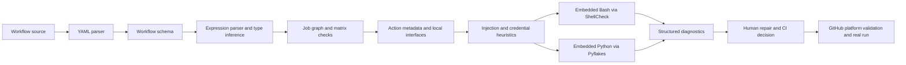

# Local workshop: diagnose and repair workflows with actionlint

Static analysis moves many GitHub Actions failures from a queued remote run to
the editor or terminal. It does not prove that a workflow is correct, secure, or
operational, but it can reject malformed schemas, impossible expressions,
broken dependency graphs, invalid matrices, wrong action inputs, and unsafe
script construction before GitHub allocates a runner.

This workshop extends the [Workflow syntax chapter](../README.md). It uses six
deliberately broken, non-executable workflow fixtures and one clean reference.
There is no notebook: the objects under study are workflow files, diagnostics,
and the actual local/CI validation boundary.

## Outcomes and success criteria

After 60–90 minutes, you can:

1. explain how parsing, workflow-schema checks, expression typing, graph
   analysis, action metadata, and delegated script linters form separate layers;
2. install and identify a reviewed `actionlint` release instead of silently
   downloading “latest” in CI;
3. interpret diagnostic location, message, rule kind, snippet, and exit status;
4. repair schema, expression, job-dependency, matrix, local-action-input, and
   untrusted-interpolation failures;
5. distinguish built-in findings from ShellCheck and Pyflakes findings;
6. configure custom runner labels and repository variables without blanket
   suppression;
7. choose editor, pre-commit, required CI, and security-analysis integrations;
   and
8. state what only a real GitHub run, repository policy, or threat model can
   establish.

Completion requires all six diagnostic contracts to pass, the clean reference
to produce zero findings, the script-linter comparison to be recorded, and a
CI design that pins both the installer input and executable version.

## Scenario, prerequisites, and safety

Northstar's release workflow has accumulated small review mistakes: `branch`
instead of `branches`, an invented matrix property, a renamed job that left a
stale `needs`, an impossible exclusion, a misspelled local-action input, and an
issue title embedded directly into shell source. Each error is small; together
they waste runner time, hide the intended graph, and create a script-injection
path.

You need the repository, Node.js 24 or newer, and a local `actionlint` 1.7.12
binary. ShellCheck and Pyflakes are optional for the layered-script experiment.
Complete the main Workflow syntax chapter first.

Safety rules:

- Never copy `fixtures/*.yml.txt` into `.github/workflows`; the `.txt` suffix is
  a deliberate execution barrier.
- Work in a temporary directory when repairing the cases.
- The fixtures require no token, secret, network endpoint, or external write.
- Do not weaken a diagnostic with a broad ignore merely to make the command
  green. Explain every narrow exception with an owner and expiry.
- Treat linter output as evidence about the checked source and tool version—not
  proof that an external action or runtime behavior is safe.

## Mental model: a layered compiler front end



`actionlint` parses the workflow as GitHub Actions syntax rather than generic
YAML. It builds typed expression/context objects, resolves `needs` edges and
matrix shapes, recognizes workflow events, inspects action usage, and applies
security-oriented checks. When `shellcheck` or `pyflakes` is available, it
extracts suitable `run:` bodies and delegates language-specific analysis.

The phases matter. Fix the earliest structural error first: a parser or schema
failure can prevent later analysis from seeing the intended graph. Then repair
semantic errors and rerun the whole file, because one fix can expose another
diagnostic.

Every diagnostic has five useful fields:

- file and position identify the source span;
- message describes the violated invariant;
- snippet shows the analyzed source;
- `kind` identifies the rule family, such as `expression` or `job-needs`; and
- process exit status lets CI enforce the result.

The workshop verifier uses JSON formatting rather than scraping human-colored
text. Its contract requires the expected rule kind for each fixture and zero
diagnostics for the reference workflow.

## Install a known release

Version 1.7.12 is the current upstream release as verified on 2026-09-27. The
release publishes platform archives and SHA-256 digests. On Apple Silicon:

```bash
mkdir -p .tools/actionlint
gh release download v1.7.12 --repo rhysd/actionlint \
  --pattern 'actionlint_1.7.12_darwin_arm64.tar.gz' \
  --dir .tools/actionlint
printf '%s  %s\n' \
  'aba9ced2dee8d27fecca3dc7feb1a7f9a52caefa1eb46f3271ea66b6e0e6953f' \
  '.tools/actionlint/actionlint_1.7.12_darwin_arm64.tar.gz' | shasum -a 256 --check
tar -xzf .tools/actionlint/actionlint_1.7.12_darwin_arm64.tar.gz \
  -C .tools/actionlint actionlint
.tools/actionlint/actionlint -version
```

For Linux x86-64, use archive
`actionlint_1.7.12_linux_amd64.tar.gz`, digest
`8aca8db96f1b94770f1b0d72b6dddcb1ebb8123cb3712530b08cc387b349a3d8`,
and `sha256sum --check`. Use the official installation guide for other systems.
Upstream also publishes artifact attestations for current releases; when your
environment supports GitHub artifact verification, verify the downloaded
archive as another provenance signal.

Package-manager, pre-commit, container, and `go install` paths are convenient,
but record the resolved version. A floating local tool and a pinned CI tool can
produce different findings. A versioned container tag is not an immutable image
digest.

## Baseline: measure the diagnostic contract

From the repository root:

```bash
cd curriculum/beginner/02-workflow-syntax/actionlint-workshop
npm ci --ignore-scripts --no-audit --no-fund
ACTIONLINT_BIN=../../../../.tools/actionlint/actionlint npm run verify
```

Adjust `ACTIONLINT_BIN` if you installed the executable elsewhere. The report at
`reports/diagnostics.json` should show:

- `caseCount: 6` and `casesPassed: 6`;
- `casePassRate: 1`;
- all fixtures returning a non-zero lint exit status and their expected kind;
  and
- `solutionPassed: true` with zero reference diagnostics.

The verifier deliberately disables ShellCheck and Pyflakes for this baseline.
That makes the six core contracts reproducible even when those optional tools
are not installed. It does not imply that embedded scripts should skip language
analysis in production.

Inspect one raw JSON diagnostic:

```bash
.tools/actionlint/actionlint -no-color -shellcheck= -pyflakes= \
  -format '{{json .}}' \
  curriculum/beginner/02-workflow-syntax/actionlint-workshop/fixtures/02-expression-context.yml.txt
```

## Repair loop

Create a disposable working directory and copy the cases:

```bash
workshop_dir="$(mktemp -d)"
cp curriculum/beginner/02-workflow-syntax/actionlint-workshop/fixtures/*.yml.txt \
  "$workshop_dir"
```

For each copy, follow this loop:

1. predict the rule kind and source location before running the tool;
2. run `actionlint` against that single file;
3. explain the violated invariant in workflow terms;
4. apply the smallest repair without suppressing the diagnostic;
5. rerun that file until it has zero core findings; and
6. compare the repair with `solutions/02-actionlint-clean.yml` only after all
   six predictions are recorded.

### Case 1 — workflow schema

`branch` is valid YAML text but not a valid `push` filter. Change it to
`branches`. This demonstrates why a generic YAML parser is necessary but
insufficient: syntax validity says nothing about GitHub's domain schema.

### Case 2 — expression shape

The matrix defines `os`; `matrix.platform` cannot exist. Replace the property or
change the matrix contract. Do not add a null fallback merely to hide a typo:
that would turn a statically provable defect into runtime ambiguity.

### Case 3 — dependency graph

`package` depends on the nonexistent job ID `compile`. Point it to `build`.
Human-facing job names are not dependency identifiers. A valid `needs` edge
controls scheduling and makes the upstream result/outputs available.

### Case 4 — matrix value space

The exclusion names Node 24 even though only 20 and 22 are declared. Remove the
dead exclusion or add the intended value. A configuration that never matches is
often a stale compatibility decision.

### Case 5 — action interface

The local action declares required input `message`; the caller supplies
`messages`. Correct the input name. Because the action is repository-local,
`actionlint` can inspect its metadata and also report the missing required
input. Remote action metadata coverage is not universal, so dependency review
and a real run still matter.

### Case 6 — generated script boundary

`${{ github.event.issue.title }}` is potentially attacker-controlled and is
inserted into the shell program before Bash runs. Move the value to `env`, then
expand a quoted shell variable:

```yaml
- env:
    ISSUE_TITLE: ${{ github.event.issue.title }}
  run: printf '%s\n' "$ISSUE_TITLE"
```

This changes the title from program text to data. It does not authorize the
value for a privileged operation; validation and least privilege remain
separate responsibilities.

## Experiment: delegated script analysis

Install ShellCheck and Pyflakes using your managed development environment,
record their versions, then run the sixth fixture without disabling them:

```bash
shellcheck --version
pyflakes --version
actionlint \
  curriculum/beginner/02-workflow-syntax/actionlint-workshop/fixtures/06-untrusted-scripts.yml.txt
```

Compare the result with the core-only baseline. You should now see:

- the built-in untrusted-expression diagnostic;
- ShellCheck findings for unquoted `$FILES` and `$file`; and
- a Pyflakes undefined-name finding for `undefined_name`.

The layers answer different questions. `actionlint` understands the workflow
context and extracts script bodies; ShellCheck understands shell expansion;
Pyflakes understands Python names. If those executables are missing,
`actionlint` skips their integrations. CI must install them deliberately or use
an environment that contains them, then print versions so missing coverage is
observable.

Fix the script findings by quoting expansions and defining Python data. Rerun
all layers. Record counts by diagnostic kind before and after repair; do not
combine unlike warnings into a fabricated severity score.

## Configuration without hiding debt

Most repositories need no `.github/actionlint.yaml`. Add one only for facts the
linter cannot infer, such as approved self-hosted labels or known configuration
variables:

```yaml
self-hosted-runner:
  labels:
    - linux-ephemeral-*
config-variables:
  - DEFAULT_RUNNER
paths:
  .github/workflows/legacy.yml:
    ignore:
      - 'documented narrow message pattern'
```

Path-specific ignores match diagnostic messages with regular expressions. A
suppression can hide future defects if it is broad. Require a reason, owner,
issue link, and removal condition in review. Prefer changing the source,
declaring an actual custom label/variable, or upgrading the pinned analyzer.

When GitHub introduces syntax before the pinned linter supports it, verify the
platform documentation, isolate the smallest false positive, track upstream
support, and keep real-run evidence. The main syntax chapter demonstrates this
compatibility problem with evolving concurrency syntax.

## Put feedback at the right stage

| Integration | Feedback speed | Strength | Limitation | Recommended role |
| --- | --- | --- | --- | --- |
| Editor extension | Keystroke-time | Precise local repair loop | Developer setup can drift | Optional convenience with pinned CLI |
| Pre-commit | Before commit | Prevents known local defects | Can be bypassed; tool installation required | Fast changed-file feedback |
| Required CI | Before merge | Consistent version and auditable result | Starts only after push; consumes runner time | Authoritative static-analysis gate |
| Problem matcher | During CI | Inline annotations in GitHub | Presentation only; not another analysis layer | Improve navigation |
| Reviewdog | Pull-request review | Diff-focused reporting | Adds action/token/dependency surface | Use only with reviewed permissions and SHA pins |
| GitHub workflow validation | On platform | Current platform parser/settings | Some feedback requires push/run | Final platform compatibility |
| `zizmor` and threat modeling | Review/CI | Security-specific attack paths | Not a syntax/runtime correctness proof | Complement, never replace, actionlint |
| Real practice run | After static checks | Events, permissions, services, runners, policy | Slower and stateful | Behavioral and operational evidence |

The local and CI commands should resolve the same analyzer version and config.
Use machine-readable output for regression contracts and human/problem-matcher
output for repair. Keep the required check name stable when branch rules depend
on it.

## Current capability and open problems

As verified on 2026-09-27, v1.7.12 is the latest `actionlint` release. Its
built-in checks cover workflow keys, expressions and context availability,
dependency graphs, matrix values, events and filters, schedules and IANA
timezones, runner labels, permissions, local and common action inputs, reusable
workflows, injection patterns, credentials, action metadata, deprecated inputs,
and YAML anchors. Version 1.7.12 added current schedule-timezone and environment
deployment syntax, illustrating why analyzer/platform compatibility must be
managed rather than assumed.

**Established practice** combines fast local linting, embedded-script analysis,
fixture or application tests, security analysis, and a bounded GitHub run.
**Maturing practice** publishes machine-readable diagnostics through editor,
pre-commit, problem-matcher, or diff-review interfaces while keeping one pinned
required CI contract. Central reusable or required workflows can reduce version
drift, but they also need change management and compatibility testing.

The hard problems are platform skew and incomplete static knowledge. GitHub.com
can introduce keys before a released analyzer understands them; GHES can lag
both. Dynamic expressions, remote action implementation, organization rules,
secrets, runner inventory, and external system state may be unknowable locally.
More heuristics are not a substitute for runtime evidence or authorization
tests. Treat a new false positive or false negative as a compatibility case to
minimize, reproduce, and track—not as justification for disabling a rule class.

## Failure modes and anti-patterns

| Failure | Why it happens | Better control |
| --- | --- | --- |
| Command reports no files | Wrong working directory or only nonstandard paths | Pass explicit paths in CI and test the scanned-file count |
| Shell/Python defects disappear | ShellCheck or Pyflakes is absent | Install deliberately, print versions, and preserve a layered test case |
| Local and CI results differ | Floating versions, different config, or delegated linters | Pin and identify the entire analysis environment |
| New GitHub syntax is rejected | Analyzer/platform/GHES versions differ | Verify docs, isolate narrowly, track upstream support, retain a real-run test |
| Broad ignore makes CI green | Regex suppression matches unrelated future findings | Fix source or scope exception by path/message with owner and expiry |
| Linter install is compromised | Mutable tag/script/download executes in a privileged job | Verify release digest/attestation and minimize job permissions |
| Required lint check is absent | Trigger/path filters do not cover protected changes | Align the validation trigger with branch rules and keep the check stable |
| Zero findings becomes approval | Static contract is mistaken for security/runtime proof | Require threat review, fixture tests, and bounded GitHub execution |

## What actionlint cannot prove

A zero-diagnostic result does not prove:

- that branch/path filters match the organization’s required-check policy;
- that a secret, environment, OIDC trust condition, or runner group exists;
- that a remote action SHA is trustworthy or its transitive code is safe;
- that a shell command has correct business behavior;
- that services, networks, caches, artifacts, or external APIs work at runtime;
- that an authorization decision is appropriate for the triggering actor;
- that retries, side effects, rollback, and incident evidence are safe; or
- that new GitHub.com syntax is available on a particular GHES version.

Static analysis is one gate in a chain: parse and type locally, analyze scripts
and security, run deterministic fixture tests, validate on GitHub, execute
bounded scenarios, and inspect the resulting graph and evidence.

## Evaluation and production upgrade

Use these workshop measures:

| Measure | Target |
| --- | ---: |
| Expected diagnostic-case coverage | 6 / 6 |
| Clean reference false positives | 0 |
| Repair rate | 6 / 6 cases reach zero core findings |
| Script-layer visibility | Built-in, ShellCheck, and Pyflakes sources identified |
| Unexplained suppressions | 0 |
| Mutable executable/action references in CI | 0 |

For production, pin the downloaded release and verify its digest or attestation;
pin checkout/setup actions to reviewed full SHAs; use read-only permissions and
no persisted checkout credential; install and version delegated linters; emit
annotations plus a retained JSON/SARIF-style report where appropriate; test the
validator upgrade against the diagnostic fixtures; and document the update
owner. Keep a break-glass path for analyzer defects, but require a narrow,
reviewed exception instead of disabling the gate.

## Review questions and extensions

1. Why can valid YAML still be an invalid workflow?
2. Which information allows `actionlint` to reject `matrix.platform` before a
   run exists?
3. Why does fixing a `needs` identifier affect both scheduling and context
   availability?
4. What is the security difference between expression interpolation in `run`
   and passing the same value through `env`?
5. Why should missing ShellCheck or Pyflakes be visible in CI?
6. Design a narrow suppression lifecycle for one GHES syntax lag.
7. Add a seventh fixture for a misspelled repository `vars` property and a
   matching `config-variables` contract.
8. Compare human, JSON, problem-matcher, and pull-request annotation output for
   the same finding.
9. Decide whether a large organization should centralize the validation job as
   a reusable workflow or a required workflow, and define its version policy.

## Authoritative references

- [`actionlint` project and feature overview](https://github.com/rhysd/actionlint)
- [`actionlint` checks reference](https://github.com/rhysd/actionlint/blob/v1.7.12/docs/checks.md)
- [`actionlint` installation guide](https://github.com/rhysd/actionlint/blob/v1.7.12/docs/install.md)
- [`actionlint` usage and integrations](https://github.com/rhysd/actionlint/blob/v1.7.12/docs/usage.md)
- [`actionlint` configuration](https://github.com/rhysd/actionlint/blob/v1.7.12/docs/config.md)
- [`actionlint` v1.7.12 release](https://github.com/rhysd/actionlint/releases/tag/v1.7.12)
- [GitHub Actions workflow syntax](https://docs.github.com/en/actions/reference/workflows-and-actions/workflow-syntax)
- [GitHub secure-use reference](https://docs.github.com/en/actions/reference/security/secure-use)
- [ShellCheck](https://www.shellcheck.net/)
- [Pyflakes](https://github.com/PyCQA/pyflakes)

Return to the [Workflow syntax chapter](../README.md), continue the main
[release-orchestration lab](../exercises/README.md), or inspect the
[clean reference](../solutions/02-actionlint-clean.yml).
