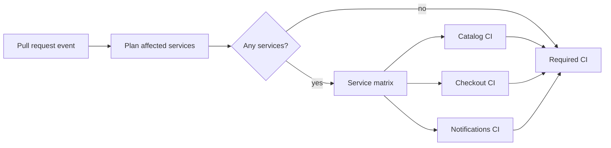

# Workflow design: dependable and efficient CI graphs

A valid workflow can still be a poor system. It may test the wrong revision,
repeat expensive work, hide failures behind skipped jobs, let stale runs consume
capacity, or centralize so much logic that one change breaks every repository.
Workflow design is the discipline of turning business risk and repository
structure into an explicit, observable execution graph.

This course uses a workflow-native lab rather than a notebook. GitHub itself is
the scheduler, event source, permissions engine, log store, and graph viewer that
learners need to observe.

## Learning objectives

After completing the chapter and lab, you can:

1. model a workflow as a directed acyclic graph (DAG) and locate its critical
   path, parallel fan-out, and fan-in gates;
2. calculate wall-clock latency separately from runner consumption and explain
   when greater parallelism helps one while hurting the other;
3. derive an affected-service matrix from changed files and a dependency graph,
   including dependents, global inputs, documentation-only changes, and a
   fail-safe for unmapped paths;
4. design stable required checks, concurrency groups, cache permissions,
   artifact handoffs, and failure propagation;
5. choose among native path filters, Git-based planners, changed-file actions,
   and monorepo build systems using operational and security criteria;
6. publish a versioned reusable-workflow contract and know when a composite
   action, script, template, or ordinary YAML is the better boundary; and
7. evaluate selective CI for correctness, latency, cost, robustness, and
   maintainability instead of treating a green run as sufficient evidence.

## Prerequisites and boundaries

Complete [Actions foundations](../../beginner/01-actions-foundations/README.md)
and [Workflow syntax](../../beginner/02-workflow-syntax/README.md), or be able to
explain events, refs, job isolation, `needs`, outputs, matrices, contexts, and
least-privilege permissions.

The lab uses a credential-free Node.js 24 fixture and GitHub-hosted runners. It
does not deploy, publish packages, write to the repository, or require secrets.
Use a fork or practice repository because each experiment consumes Actions
capacity. Deployment approvals and cloud identity belong to the next course,
[Deployment patterns](../02-deployment-patterns/README.md).

## Scenario and success criteria

Northstar Commerce has one repository containing `catalog`, `checkout`, and
`notifications` services plus a shared money library. Checkout depends on
catalog; all three consume the shared library. The current CI workflow runs all
service suites for every pull request. Developers receive trustworthy results,
but a documentation change spends the same capacity as a shared-library change.

Your task is to replace indiscriminate fan-out with a change planner and a
versioned service-CI contract without creating false negatives.

Completion means:

- all six labeled change cases select the exact expected service set;
- a catalog change tests both catalog and its checkout dependent;
- an unknown code path fails closed by selecting all services;
- the stable `Required CI` check exists for code and documentation changes;
- required service failure fails the aggregate gate;
- two quick pushes demonstrate stale-run cancellation;
- the reference run uploads one commit-bound report per selected service; and
- your evaluation compares baseline and selective job count, runner time,
  critical path, selection correctness, and failure behavior.

The goal is not minimum job count. The goal is the least work that preserves the
declared validation contract.

## Mental model: compile change risk into a job graph

Treat workflow design as a small compiler:

```text
event + tested revision + changed paths + dependency graph + policy
                              ↓
                 validated affected-service plan
                              ↓
                   bounded matrix of CI jobs
                              ↓
                stable aggregate required check
```

The source model describes risk: what changed, what depends on it, and what must
always run. The compiled model is GitHub's job DAG. Every `needs` edge expresses
both ordering and data availability. Jobs without a dependency edge may run in
parallel and always receive fresh runner state.



The plan is an auditable data product, not a loose collection of step-level
conditions. It contains selected services, selection reasons, a matrix, an
empty-plan signal, cost estimates, and whether the fail-safe activated.

## Foundations: latency, capacity, and selection quality

### DAG critical path

For job duration `d(v)` and predecessor set `pred(v)`, the earliest finish time
is:

```text
EF(v) = d(v) + max(EF(u) for u in pred(v))
```

The workflow's idealized compute latency is the largest finish time. Queueing,
runner startup, action downloads, and API delays add overhead. Shortening a job
off the critical path may reduce runner consumption without changing wall-clock
latency. Shortening or parallelizing a critical-path job can improve both.

In the fixture, planning is estimated at 0.4 minutes and the service suites at
3.2, 4.6, and 2.5 minutes. An all-service parallel run has an estimated compute
critical path of `0.4 + max(3.2, 4.6, 2.5) = 5.0` minutes, while runner
consumption is `0.4 + 3.2 + 4.6 + 2.5 = 10.7` runner-minutes. Parallelism does
not make the work free.

### Fan-out and fan-in

A matrix creates one job for every expanded combination. If three services run
on two operating systems and two runtime versions, the unmodified Cartesian
product creates `3 × 2 × 2 = 12` jobs. `include` can add combinations and
`exclude` removes them. `max-parallel` bounds simultaneous demand, not total
work. `fail-fast` controls sibling cancellation; it does not define whether a
failed child is required.

Fan-in is the gate after parallel work. A stable fan-in job gives branch
protection one check name regardless of how many matrix children existed. Its
condition must run after upstream failure, but its script must explicitly reject
bad conclusions. `always()` alone is not a success policy.

### Selective-CI correctness

Let `I` be the services truly impacted by a change and `S` the services selected
by the planner:

```text
recall    = |S ∩ I| / |I|
precision = |S ∩ I| / |S|
```

A missed impacted service lowers recall and can merge a defect. An extra service
lowers precision and wastes capacity. CI generally prioritizes recall, then
optimizes precision. Because the true set is rarely known automatically, teams
maintain labeled change cases, periodically run full validation, and compare
selective results with the baseline.

## Internal mechanics of change detection

### Select the comparison deliberately

GitHub's top-level `paths` filter and a custom planner both depend on a diff.
For pull requests, GitHub documents a three-dot comparison from the merge base;
pushes to existing branches use a two-dot comparison. Native filtering may run
all work if a diff times out or a push exceeds its commit limit, while a very
large changed-file set can prevent a later matching path from being considered.
See the current [workflow syntax path-filter
reference](https://docs.github.com/en/actions/reference/workflows-and-actions/workflow-syntax#onpushpull_requestpull_request_targetpathspaths-ignore)
rather than copying volatile limits into platform policy.

The reference lab checks out full history and compares the pull request's
explicit base and head SHAs. A shallow checkout may not contain the base object;
[`shallow-history.yml.txt`](fixtures/shallow-history.yml.txt) isolates that
failure. Production planners should log both SHAs, the merge base where
applicable, and the final changed-file list without leaking sensitive content.

### Path ownership is not dependency impact

`services/catalog/**` identifies catalog as the directly changed component, but
checkout also depends on catalog. Directory filters alone cannot infer that
reverse dependency. The fixture's [`service-graph.json`](monorepo-fixture/service-graph.json)
defines component roots and `dependsOn` edges. The planner computes transitive
dependents, so a shared-library change fans out to all consumers.

Global inputs—lockfiles, workflow definitions, toolchain configuration, and the
dependency graph itself—select all services. Documentation paths select none.
An unrecognized source path also selects all services and sets `failSafe=true`.
Failing open for cost but closed for correctness is safer than silently skipping
an unknown component.

### Keep a required check present

If a required workflow is skipped by branch filtering, path filtering, or a
commit-message rule, GitHub warns that its associated check can remain pending
and block merging. That failure is shown in
[`path-filter-required-check.yml.txt`](fixtures/path-filter-required-check.yml.txt).
For a repository-wide required CI contract, trigger the lightweight planner for
every pull request, skip expensive jobs inside the graph, and always produce the
same aggregate check.

## Architecture patterns

### Pattern 1: run everything

The baseline is easy to reason about and maximizes recall. It is appropriate for
small repositories, safety-critical validation that cannot be partitioned, or a
periodic backstop. Its cost grows with repository size even when the change is
local. Preserve it as an experiment and scheduled audit after introducing
selection.

### Pattern 2: one workflow per path boundary

Native top-level `paths` is dependency-free and clear for genuinely independent
areas. It is weak when one stable check must always appear, shared code affects
several services, or selection needs to be explained. The order of positive and
negative patterns matters, and branch and path filters must both match when used
together.

### Pattern 3: planner plus dynamic matrix

A planner job emits structured JSON through a job output. A downstream matrix
uses `fromJSON` to fan out. This makes selection visible and testable, supports
dependency propagation, and can estimate cost before starting jobs. It adds
code that must be owned, versioned, and evaluated. Bound matrix size and reject
malformed output before it reaches scheduling.

### Pattern 4: build-system-native affected graph

When the build system already knows project and task dependencies, use that
graph instead of maintaining a second path map. Nx's official
[`affected`](https://nx.dev/docs/features/ci-features/affected) command combines
Git changes with its project graph and includes dependent projects. Turborepo,
Gradle, Pants, and Bazel provide related filtering, task-graph, or query
capabilities. This can improve fidelity and caching but couples CI design to the
build system and its graph quality.

### Pattern 5: centralized reusable workflow

A reusable workflow owns jobs, runners, permissions, environments, and outputs.
It is suitable for organization-standard test or deployment policy. A caller
invokes the whole workflow as a job. GitHub documents that nested workflows
cannot elevate `GITHUB_TOKEN` permissions and that billing and GitHub-hosted
runner selection remain in the caller's context. Review current access and
nesting constraints in [Reusing workflow
configurations](https://docs.github.com/en/actions/reference/workflows-and-actions/reusing-workflow-configurations).

Centralization reduces drift but increases blast radius. Treat inputs, secrets,
outputs, permissions, cache access, and failure behavior as an API. Add optional
inputs compatibly within `v1`; create `v2` for removals, type changes, stricter
requirements, or changed semantics. Cross-repository callers should pin a
reviewed immutable commit for reproducibility and receive update PRs rather than
following a mutable default branch.

## Reuse boundaries: choose the smallest honest abstraction

| Mechanism | Packages | Best fit | Important limitation |
| --- | --- | --- | --- |
| YAML anchor/alias | Repeated YAML nodes in one file | Small local duplication | No cross-file contract or independent release |
| Script or package command | Deterministic implementation | Logic testable outside Actions | Does not own runner or job policy |
| Composite action | Steps inside the caller's job | Repeated setup/tool sequence | Cannot own multiple jobs or a runner |
| Reusable workflow | Jobs and orchestration | Standard CI/deployment contract | Caller cannot append steps to the called job |
| Workflow template | Starter file copied into a repository | Bootstrap and discoverability | Copies can drift after creation |

The reference solution keeps change planning in a tested Node module, uses a
reusable workflow for the service-job contract, and leaves event selection and
fan-out with the caller. This separation makes the algorithm locally testable
without pretending a local test reproduces GitHub scheduling.

GitHub's current reuse overview also distinguishes deterministic reusable
workflows from newer agentic workflows that apply contextual judgment. CI gates
should remain deterministic: an agent may propose a change or summarize
evidence, but an auditable planner and tests should decide whether required work
passed. See [Reusing workflow
configurations](https://docs.github.com/en/actions/concepts/workflows-and-actions/reusing-workflow-configurations).

## State and data movement

### Outputs

Step outputs become job outputs and cross a `needs` edge as strings. Use compact,
validated metadata such as the matrix and selection flags. Outputs have platform
limits and are not an artifact store. Never place secrets in outputs or summaries.

### Artifacts

Artifacts move deliberate run products between jobs or retain evidence after the
run. Name them with service and commit identity, set retention explicitly, and
fail when a required report is missing. The lab uploads one JSON result per
service. A deployment course would add a digest and promote the exact tested
artifact.

### Caches

Caches speed recreation of dependencies or derived inputs across runs; they are
not authoritative build outputs. Keys should include operating system,
toolchain, and lockfile identity. Restore prefixes trade hit rate for exactness.

Cache contents cross run boundaries, so trust matters. Current GitHub workflow
syntax supports `cache-mode` values that independently grant restore and save
capabilities. Low-trust pull requests should not be granted cache writes; the
unsafe pattern is captured in
[`cache-poisoning.yml.txt`](fixtures/cache-poisoning.yml.txt). The canonical
[dependency-caching reference](https://docs.github.com/en/actions/reference/workflows-and-actions/dependency-caching)
should determine current defaults and access behavior.

## Concurrency and cancellation semantics

CI for commit `A` becomes stale when the same pull request receives commit `B`.
The lab groups by workflow plus pull request number or ref and sets
`cancel-in-progress: true`. Cancellation saves capacity and reduces the chance a
reviewer reads obsolete evidence. A deployment or migration may instead require
serialization and reconciliation rather than interruption.

Concurrency groups are repository-wide and case-insensitive. Reusing a generic
group across workflows can cancel unrelated runs. Current GitHub syntax also
supports queue controls for workloads that must retain multiple pending runs;
verify availability and incompatibilities in the [concurrency
reference](https://docs.github.com/en/actions/reference/workflows-and-actions/workflow-syntax#concurrency)
before adopting newer keys. Cancellation is cooperative: cleanup and external
systems need their own idempotency and reconciliation design.

## Technology landscape

| Option | Strengths | Limitations and risk | Choose when |
| --- | --- | --- | --- |
| Native `paths` | No dependency; workflow-level gate | No job-level selection or dependency propagation; skipped required check risk | Areas are independent and checks need not be universal |
| `git diff` + owned script | Auditable, portable, locally testable | You own event/base semantics and graph maintenance | Repository model is modest or bespoke |
| [`dorny/paths-filter`](https://github.com/dorny/paths-filter) | Maintained job/step filters and changed-file lists | Third-party executable dependency; path map still lacks a semantic project graph | Glob-based job routing is enough |
| [`tj-actions/changed-files`](https://github.com/tj-actions/changed-files) | Broad event support, matrices, file formats | Third-party supply-chain surface; a 2025 compromise affected mutable tags | Adopt only after security review and immutable pinning |
| Nx affected | Project graph, transitive impact, task integration | Nx adoption and correct project metadata required | Nx already owns the workspace graph |
| Turborepo filters | Task-aware selection and cache integration | JavaScript/TypeScript ecosystem focus | Turborepo already orchestrates the repository |
| Bazel/Pants/Gradle graph | Precise build-system dependency knowledge | Higher build-system complexity | Large polyglot or JVM systems already use the tool |

Popularity is not a trust boundary. GitHub's reviewed advisory for
[CVE-2025-30066](https://github.com/advisories/ghsa-mrrh-fwg8-r2c3)
documents how moved tags in a changed-files action exposed secrets. GitHub's
[secure-use reference](https://docs.github.com/en/actions/reference/security/secure-use)
states that a full commit SHA is the immutable way to consume a third-party
action. Minimize token permissions, secrets, and network reach even when pinned;
an immutable malicious or vulnerable version is still harmful.

Common supporting tools include
[`actionlint`](https://github.com/rhysd/actionlint) for static workflow checks,
[`zizmor`](https://github.com/woodruffw/zizmor) for security-oriented analysis,
the [GitHub CLI](https://cli.github.com/manual/gh_run) for run inspection, and
the Actions REST endpoints for
[workflow runs](https://docs.github.com/en/rest/actions/workflow-runs) and
[workflow jobs](https://docs.github.com/en/rest/actions/workflow-jobs). Local
emulators can shorten feedback loops but do not prove GitHub event, permission,
runner-image, service, or scheduling behavior.

## State of the art as of September 2026

**Established practice:** explicit least privilege, immutable third-party
dependencies, dependency-aware selection, bounded matrices, reusable contracts,
stable aggregate checks, stale-run cancellation, and periodic full-validation
backstops are mature production patterns.

**Current platform direction:** GitHub has expanded native workflow composition
with reusable workflows, YAML anchors, cache access modes, deeper concurrency
queues, Actions policies, and organization or enterprise rulesets that can
require workflows. Rulesets centralize merge requirements; workflow execution
protections can constrain actors, events, and workflow paths. Availability can
depend on plan and rollout, so use the current [ruleset workflow
documentation](https://docs.github.com/en/repositories/configuring-branches-and-merges-in-your-repository/managing-rulesets/available-rules-for-rulesets#require-workflows-to-pass-before-merging)
and [Actions policy documentation](https://docs.github.com/en/actions/concepts/about-actions-policies)
instead of assuming every repository exposes the same controls.

**Emerging practice:** organizations increasingly combine repository-owned task
graphs, remote caches, distributed execution, ephemeral runner scale sets, and
central policy workflows. These systems can reduce time to signal, but they add
control planes, cache trust, tenancy, and observability requirements.

**Open problems:** impact analysis becomes stale as hidden runtime dependencies
grow; queue delay can dominate optimized compute; shared caches broaden trust;
central contracts can break many callers; and platform billing data does not by
itself reveal whether skipped work was correct. Safe optimization therefore
needs continuous evaluation, not a one-time path map.

## Worked scenario: from path to plan

The fixture's graph is:

```text
shared ──► catalog ──► checkout
   └────────────────► checkout
   └────────────────► notifications
```

For `services/catalog/src/catalog.mjs`, the planner:

1. normalizes and deduplicates changed paths;
2. maps the path to the directly changed catalog service;
3. walks reverse dependencies and adds checkout;
4. sorts results for deterministic output;
5. emits `matrix.include` entries with service and directory;
6. estimates two selected jobs, one avoided job, and the critical path; and
7. records a human-readable reason for each selection.

For `docs/operating-model.md`, it emits an empty service matrix and an explicit
`run_services=false` output. For `tools/generator/index.mjs`, no mapping exists,
so it selects all services and records an unmapped-path fail-safe. Silent empty
selection would be cheaper and wrong.

## Implementation walkthrough

The runnable implementation lives in [`monorepo-fixture`](monorepo-fixture/):

- `src/change-plan.mjs` contains deterministic selection and cost logic;
- `service-graph.json` declares component roots, dependencies, global inputs,
  ignored paths, and estimates;
- `change-cases.json` is the labeled evaluation set;
- `scripts/plan-changes.mjs` adapts local output to `GITHUB_OUTPUT` and
  `GITHUB_STEP_SUMMARY`;
- `scripts/evaluate-planner.mjs` compares selection with labels; and
- the three small services generate genuine test results and report artifacts.

Run it without credentials:

```bash
cd curriculum/intermediate/01-workflow-design/monorepo-fixture
npm ci --ignore-scripts --no-audit --no-fund
npm test
npm run evaluate
CHANGED_FILES_JSON='["services/catalog/src/catalog.mjs"]' npm run plan
SERVICE=catalog npm run test:service
```

The [baseline workflow](exercises/01-baseline-monorepo-ci.yml) statically runs
all services. The [selective caller](solutions/01-selective-monorepo-ci.yml)
plans the change, expands a dynamic matrix, calls the
[`v1` reusable workflow](solutions/02-reusable-service-ci.yml), and converges on
`Required CI`. The reusable workflow validates its service allowlist before
using any input in paths or commands.

## Experiments and evaluation

Follow the complete [workflow lab](exercises/README.md). The core comparison is:

| Change | Baseline jobs | Expected selective jobs | Required evidence |
| --- | ---: | ---: | --- |
| Documentation only | 3 | 0 | Planner and `Required CI` succeed |
| Notifications only | 3 | 1 | Only notifications report exists |
| Catalog | 3 | 2 | Catalog and checkout are selected |
| Shared library | 3 | 3 | Every dependent is selected |
| Workflow or lockfile | 3 | 3 | Global-input reason is visible |
| Unmapped code path | 3 | 3 | Fail-safe is `true` |

Collect run and job timestamps from the UI or API. Report at least:

- exact-case rate and any false negative;
- selected jobs and jobs avoided;
- workflow elapsed time and compute critical path;
- sum of job execution times as a runner-consumption proxy;
- queue delay when visible;
- cancellation outcome for the stale run;
- artifact completeness; and
- planner, matrix, and aggregate-gate conclusions.

GitHub exposes the visualization graph, job execution time, logs, and usage
details in the run UI; see [Monitor
workflows](https://docs.github.com/en/actions/how-tos/monitor-workflows).
Private-repository billable minutes may be rounded and vary by runner class, so
do not equate a simple duration sum with the invoice. Current pricing and public
repository behavior belong to the [Actions billing
documentation](https://docs.github.com/en/actions/concepts/billing-and-usage).

## Failure modes and mitigations

| Failure | Evidence | Mitigation |
| --- | --- | --- |
| Wrong base or shallow history | Missing object, incomplete changed list | Fetch required history; log and test base/head policy |
| Path map misses a component | Labeled case selects too little | Fail safe to all; require ownership for graph changes |
| Shared dependency not propagated | Consumer test absent | Use reverse dependency closure or build-system graph |
| Empty matrix fails or hides work | Expansion error or absent gate | Emit an explicit run flag and keep aggregate job stable |
| Required workflow skipped at trigger | Check stays pending | Trigger planner broadly; skip expensive jobs internally |
| Matrix child fails but gate passes | Green aggregate after red child | Inspect `needs.<job>.result` in an always-running gate |
| `fail-fast` cancels useful evidence | Siblings cancelled after first failure | Use `fail-fast: false` for diagnostic completeness |
| Generic concurrency key | Unrelated workflow is cancelled | Include workflow identity and PR/ref in the group |
| Cache poisoning | Trusted run restores untrusted content | Restrict cache writes by trust; scope keys; avoid secrets |
| Mutable third-party dependency | Same tag executes different code | Review and pin full SHA; automate controlled updates |
| Breaking reusable input change | Many callers fail validation | Publish compatibility policy and a new major contract |
| Central workflow outage | Organization-wide CI disruption | Canary rollout, contract tests, pinned versions, rollback |

## Production upgrade path

| Concern | Lab | Production target |
| --- | --- | --- |
| Graph ownership | JSON beside planner | CODEOWNERS, schema validation, architecture-source integration |
| Correctness | Six deterministic cases | Historical replay, periodic full CI, false-negative review |
| Versioning | Local `v1` input | Immutable releases, deprecation window, caller inventory |
| Dependencies | GitHub-owned major tags | Full-SHA policy, Dependabot/Renovate, allowlist, provenance review |
| Cache | Disabled in runnable lab | Trust-aware `cache-mode`, exact keys, monitoring, eviction plan |
| Runners | GitHub-hosted | Ephemeral pools, network boundaries, capacity and queue SLOs |
| Observability | Job summary and artifacts | API export, queue/critical-path dashboards, reason codes, cost attribution |
| Governance | Repository required check | Ruleset workflow, workflow policy, CODEOWNERS, change approval |
| Recovery | Rerun or revert | Version rollback, known-good full workflow, incident playbook |

Organization owners can monitor reusable-workflow usage through audit data such
as `prepared_workflow_job`, described in [Reuse
workflows](https://docs.github.com/en/actions/how-tos/reuse-automations/reuse-workflows#monitoring-which-workflows-are-being-used).
Inventory callers before removing an input or release. A centrally managed
workflow without caller visibility is an undocumented distributed API.

## Review questions and extensions

1. Why can an optimization reduce runner-minutes without reducing the critical
   path?
2. Which change in the fixture selects checkout but not catalog?
3. Why is a workflow-level `paths` filter risky for a universally required
   check?
4. How would you label ground truth for a database schema used by all services?
5. When should the planner fail the run instead of failing safe to all services?
6. Which reusable-workflow changes require a new major contract?
7. Design a scheduled backstop that detects planner false negatives without
   running full CI for every pull request.
8. Compare a composite action and a reusable workflow for installing a private
   toolchain. Which layer should own credentials and why?

Extensions: add a fourth service with a transitive dependency, validate the
graph against an allowed schema, query completed jobs with `gh api`, calculate
observed queue time, or replace the custom graph with an Nx/Turborepo/Bazel
affected query and compare the selected set.

## References

- GitHub Docs, [Workflow syntax](https://docs.github.com/en/actions/reference/workflows-and-actions/workflow-syntax)
- GitHub Docs, [Reusing workflow configurations](https://docs.github.com/en/actions/reference/workflows-and-actions/reusing-workflow-configurations)
- GitHub Docs, [Dependency caching](https://docs.github.com/en/actions/reference/workflows-and-actions/dependency-caching)
- GitHub Docs, [Concurrency](https://docs.github.com/en/actions/concepts/workflows-and-actions/concurrency)
- GitHub Docs, [Secure use reference](https://docs.github.com/en/actions/reference/security/secure-use)
- GitHub Docs, [Monitor workflows](https://docs.github.com/en/actions/how-tos/monitor-workflows)
- GitHub Docs, [Rules available for rulesets](https://docs.github.com/en/repositories/configuring-branches-and-merges-in-your-repository/managing-rulesets/available-rules-for-rulesets)
- Nx, [Run only tasks affected by a PR](https://nx.dev/docs/features/ci-features/affected)
- Turborepo, [Constructing CI](https://turborepo.com/docs/crafting-your-repository/constructing-ci)
- GitHub Advisory Database, [CVE-2025-30066 / GHSA-mrrh-fwg8-r2c3](https://github.com/advisories/ghsa-mrrh-fwg8-r2c3)
- `dorny/paths-filter`, [maintained repository](https://github.com/dorny/paths-filter)
- `rhysd/actionlint`, [maintained repository](https://github.com/rhysd/actionlint)
- `woodruffw/zizmor`, [maintained repository](https://github.com/woodruffw/zizmor)

Version note: platform capabilities and action generations were checked on
September 21, 2026. Follow canonical documentation and your repository policy
when later releases differ.
