# Deployment patterns: promote evidence, control risk, recover safely

Deployment is not “run a script after tests.” It is a state transition in an
external system, performed with elevated authority, under partial failure. A
sound pipeline proves which bytes were built, promotes those exact bytes,
controls who and what may change each environment, measures the result, and has
a tested response when the outcome is uncertain or unhealthy.

This course uses GitHub Actions as the lab runtime. The deployment target is a
credential-free local state store on the runner, so learners can observe real
jobs, artifacts, environments, concurrency, gates, and failure propagation
without touching production infrastructure.

## Learning objectives

After completing the chapter and lab, you can:

1. distinguish source revision, release, artifact, deployment, environment, and
   rollout, then trace their identities through a workflow;
2. build once, calculate a content digest, verify on fresh runners, and promote
   the same artifact through staging and production;
3. model deployment as a state machine with idempotency keys, explicit terminal
   states, uncertain outcomes, reconciliation, and bounded retry;
4. protect an environment with branch policy, required review, concurrency,
   narrow permissions, and short-lived OIDC credentials;
5. design canary signals and rollback conditions that fail safely rather than
   declaring success after a compensating action;
6. compare rolling, blue/green, canary, feature-flag, GitOps, package-release,
   serverless, and static-site patterns using realistic selection criteria;
7. explain checksums, GitHub artifact attestations, SBOMs, immutable releases,
   and what each does—and does not—prove; and
8. evaluate deployment safety using correctness, provenance, lead time, change
   failure, recovery, authorization, and observability evidence.

## Prerequisites, scope, and safety boundary

Complete [Workflow design](../01-workflow-design/README.md), or be comfortable
with job DAGs, artifacts, reusable contracts, environment contexts, concurrency,
and least-privilege permissions. The next course,
[Security and reliability](../../advanced/01-security-and-reliability/README.md),
deepens the attacker model and policy controls.

The default lab:

- uses Node.js 24 and only repository-owned scripts;
- writes deployment state only beneath the runner workspace;
- never requests an OIDC token, cloud credential, package permission, or
  repository write permission;
- uses `lab-staging` and `lab-production`, not real targets; and
- may consume GitHub Actions minutes and create repository deployment records.

Do not substitute a cloud, cluster, registry, or package publisher until its
identity policy, permissions, network boundary, idempotency, observability,
rollback, and ownership have been independently reviewed.

## Scenario and success criteria

Northstar Commerce is releasing its checkout service. The existing process
rebuilds during deployment, uses a long-lived credential, retries timeouts
blindly, and has no objective health gate. A successful command is treated as a
successful release even when nobody can identify the deployed digest.

You will deliver a release pipeline that:

- binds a semantic version and commit SHA to one SHA-256 artifact digest;
- verifies that identity on a fresh runner and again before each promotion;
- deploys staging first and evaluates deterministic health evidence;
- pauses at a protected mock production environment when protection is enabled;
- serializes production changes without cancelling an in-progress deployment;
- resolves both failure-before-write and failure-after-write cases correctly;
- retries only after reconciliation proves the write did not occur;
- rolls back an unhealthy canary with a compare-and-swap guard; and
- preserves a failed workflow conclusion after rollback so the incident remains
  visible.

The goal is not “green at any cost.” The goal is an explainable final state.

## Mental model: deployment is an evidence-backed state machine

Separate four identities:

```text
source identity   = repository + commit SHA
release identity  = version or immutable release record
artifact identity = cryptographic digest of the built bytes
deployment identity = target environment + artifact digest + attempt/idempotency key
```

Names and tags are useful labels. A digest is the content identity. A workflow
run ID is execution evidence. None substitutes for the others.

```mermaid
stateDiagram-v2
    [*] --> Built
    Built --> Verified: digest + manifest pass
    Verified --> Staged: deploy exact artifact
    Staged --> Approved: environment rules pass
    Approved --> Applying
    Applying --> Observing: confirmed write
    Applying --> Reconciling: timeout or lost response
    Reconciling --> Observing: target already has digest
    Reconciling --> Applying: proven not applied; bounded retry
    Observing --> Healthy: signals pass
    Observing --> RollingBack: signals fail
    RollingBack --> Failed: previous digest restored
    Healthy --> [*]
    Failed --> [*]
```



Every arrow needs an invariant and evidence. “Deploy command exited zero” is
useful but incomplete: the target must report the intended digest, and health
must be evaluated after exposure to traffic.

## Foundations and theory

### Release versus deployment versus rollout

A **release** makes a version available. A **deployment** installs or activates
an artifact in an environment. A **rollout** changes exposure over time—for
example 5%, 25%, then 100% of traffic. A feature flag can release code while
keeping behavior disabled; a rollback can change traffic or restore an artifact
without creating a new build.

Confusing these operations produces dangerous automation. Publishing a package
may be irreversible even though deploying a service is reversible. Database
migrations may outlive application rollback. “Undo” must be defined per target.

### Build once, promote many times

Build output depends on source, dependencies, toolchain, configuration, and
environment. Rebuilding in production creates a second candidate, even from the
same commit. The anti-pattern is isolated in
[`rebuild-during-deploy.yml.txt`](fixtures/rebuild-during-deploy.yml.txt).

Build once means:

1. produce an artifact in a controlled build job;
2. calculate and record its digest;
3. test and scan that artifact or a faithfully equivalent package;
4. transfer it through an artifact or registry with integrity controls; and
5. deploy by digest, not by a mutable name such as `latest`.

For artifact bytes `B`, the lab defines:

```text
artifact_id = "sha256:" + SHA256(B)
```

The manifest binds that digest to version and commit. A checksum detects changed
bytes when the expected digest is delivered through an independent trusted path.
It does not prove who built the bytes or which workflow produced them.

### Idempotency and uncertain writes

An idempotent deployment request has the same intended effect when repeated with
the same key. The lab uses:

```text
deploy:<version>:<commit-sha>
```

The target stores the key with the artifact digest. Reusing the key for another
digest is a conflict. Replaying the same key and digest returns the existing
result without another write.

A timeout is ambiguous:

```text
request sent → target applies digest → response lost → caller sees failure
```

Blind retry can duplicate a migration, notification, release, or infrastructure
change. The diagnostic
[`blind-retry.yml.txt`](fixtures/blind-retry.yml.txt) captures the mistake. The
correct loop is:

```text
attempt → uncertain result → query authoritative state
        → already applied: continue
        → definitely absent: bounded retry with same idempotency key
        → conflict/unknown: stop and escalate
```

Exactly-once effects are usually implemented as at-least-once delivery plus
deduplication and reconciliation, not by assuming a network response is truth.

### Health gates and rollback

A health gate needs a population, observation window, metric, threshold, and
comparison policy. The fixture requires at least 100 requests, error rate at or
below 2%, and p95 latency at or below 500 ms. These values are teaching inputs,
not universal production defaults.

Rollback uses compare-and-swap: restore the previous digest only if the target
still runs the digest that failed. Otherwise a stale workflow could overwrite a
newer healthy deployment. A successful rollback mitigates impact; it does not
make the attempted release successful. Preserve the failure signal and incident
evidence.

## Internal mechanics in GitHub Actions

### Artifact transport and integrity

The build job exports digest, version, and commit as job outputs and uploads the
artifact directory. Verification and deployment jobs start on clean runners,
download the named artifact, and compare all three identity fields. Artifact
storage solves run-scoped transport; a release registry or package registry is
usually the durable distribution system for production.

Use explicit artifact names, retention, and `if-no-files-found: error`. Never put
secrets in an artifact. Treat artifacts received from lower-trust workflows as
untrusted input.

### Environments and protection rules

A job that references an environment creates deployment history by default.
Protection rules are evaluated before the job is sent to a runner, and
environment secrets become available only after those rules pass. GitHub
environments can restrict branches/tags, require reviewers, prevent self-review,
add wait timers, and invoke GitHub App-based custom protection rules. Current
plan and visibility availability is documented in [Deployments and
environments](https://docs.github.com/en/actions/reference/workflows-and-actions/deployments-and-environments).

An environment name in YAML does not configure its protections. A reviewer gate
exists only after a repository administrator configures it. Current GitHub
syntax can also use `environment.deployment: false` for jobs that need
environment policy or configuration without creating a deployment record;
custom protection apps require a deployment object. Review the current behavior
in [Deploying with GitHub
Actions](https://docs.github.com/en/actions/how-tos/deploy/configure-and-manage-deployments/control-deployments).

### Concurrency is separate from environments

Environment protection and concurrency solve different problems. Naming an
environment does not automatically serialize it. Every workflow that can mutate
the same resource must participate in a compatible concurrency policy or the
target must enforce its own lock/version check.

CI can cancel stale work. Production generally should not interrupt an unknown
partial write. The lab uses `cancel-in-progress: false` and a production-specific
group. Queue order is not a transactional guarantee, so the target still checks
artifact and state identity.

### Permissions and separation of duties

Keep build and verification read-only. Add `id-token: write` only to the job that
must request OIDC identity. Add `packages: write`, `contents: write`,
`deployments: write`, `attestations: write`, or `artifact-metadata: write` only
for the exact operation requiring it. Once any permission is declared, omitted
scopes become `none`; see the current [workflow permission
reference](https://docs.github.com/en/actions/reference/workflows-and-actions/workflow-syntax#permissions).

Avoid combining untrusted build execution and powerful deployment credentials on
one runner. An approval after attacker-controlled code already ran with secrets
does not restore the boundary.

## Environment-protected deployment

A production environment should define:

- allowed branches/tags or a centrally controlled caller workflow;
- required reviewers and no self-review where separation is required;
- short-lived environment-specific credentials or OIDC role mapping;
- a deployment URL and ownership metadata;
- wait timer or automated health/change-management protection when justified;
- concurrency and target-side compare-and-swap;
- audit retention and emergency access policy; and
- an explicit policy for administrator bypass.

Manual approval is one risk control, not proof of artifact integrity or runtime
health. Reviewers need a compact evidence bundle: artifact digest, source commit,
tests/scans, staging result, planned target, change ticket when applicable, and
rollback procedure.

## Cloud deployment with OIDC

OIDC replaces stored cloud keys with a short-lived token exchange. GitHub signs
an identity token; the cloud verifies issuer, audience, and claims before issuing
a narrowly scoped credential. The workflow needs `id-token: write`, but that
permission does not itself grant cloud access—the external trust policy does.

Restrict trust using stable claims available to the provider, such as repository
and owner IDs, environment, expected event, ref, and `job_workflow_ref` for a
centrally controlled reusable workflow. GitHub's current [OIDC
reference](https://docs.github.com/en/actions/reference/security/oidc) documents
immutable subject claims for newer or opted-in repositories; name-only subject
formats and ID-bearing formats can differ. Inspect the actual claims for your
repository and update trust deliberately during migrations.

The fixture generates an expected trust contract and tests that a staging claim
cannot assume the production role. It does not request or print a token. The
adaptation boundary is shown in
[`oidc-cloud-template.yml.txt`](fixtures/oidc-cloud-template.yml.txt). Use the
provider's official login action and pin reviewed dependencies according to
policy. GitHub publishes provider guidance in [Configuring OIDC in cloud
providers](https://docs.github.com/en/actions/how-tos/secure-your-work/security-harden-deployments/oidc-in-cloud-providers).

## Provenance, attestations, SBOMs, and immutable releases

These controls answer different questions:

| Control | Primary question | Does not prove by itself |
| --- | --- | --- |
| Checksum/digest | Are these the expected bytes? | Who built them or whether they are safe |
| Manifest | Which version, commit, and files are claimed? | Claim authenticity without a signature |
| Artifact attestation | Which trusted workflow built this subject? | Runtime health or approval quality |
| SBOM attestation | Which components are declared? | Absence of vulnerabilities or undeclared behavior |
| Immutable release | Can published tag/assets be replaced? | That consumers verified or deployed them |

GitHub artifact attestations use OIDC-backed signing and can be verified with
GitHub CLI. Generating an attestation provides value only when consumers or
promotion gates verify it. The optional pattern is in
[`attested-release.yml.txt`](fixtures/attested-release.yml.txt), and the current
permissions and action version belong to GitHub's [attestation
guide](https://docs.github.com/en/actions/how-tos/secure-your-work/use-artifact-attestations/use-artifact-attestations).

GitHub's current immutable releases lock published assets and the associated tag
and automatically create a release attestation. The recommended flow is draft,
attach all assets, then publish. See [Immutable
releases](https://docs.github.com/en/code-security/concepts/supply-chain-security/immutable-releases).

## Architecture patterns

### Rolling replacement

Replace instances gradually while old and new versions coexist. It is simple
and resource-efficient, but requires backward-compatible protocols and careful
readiness checks. Rollback is another rolling transition, not instantaneous.

### Blue/green

Prepare a complete idle environment, validate it, then switch traffic. Rollback
can be a routing change, but duplicate capacity and state compatibility cost
more. Database changes still need expand/contract discipline.

### Canary or progressive delivery

Expose a small cohort, evaluate guardrails, then increase traffic. It reduces
blast radius only if cohorts are representative, signals arrive quickly, and
automation stops on bad evidence. Low traffic and noisy metrics can create false
confidence.

### Feature flags

Separate code deployment from behavior release. Flags enable cohort control and
fast disablement, but create configuration state, cleanup debt, interaction
effects, and authorization concerns. A flag is not a substitute for deployable
artifact rollback.

### GitOps pull reconciliation

A workflow updates desired state in Git; an in-cluster controller such as Argo
CD or Flux reconciles the target. This improves auditability and removes direct
cluster credentials from the build workflow. It adds another asynchronous
control loop, so deployment status must come from the reconciler—not merely the
Git commit that requested the change.

### Package, release, static-site, and serverless delivery

Package publication and immutable release creation often cannot be overwritten;
prefer draft/finalize flows and exact provenance. Static sites can use GitHub
Pages' configure/upload/deploy actions and its `github-pages` environment.
Serverless and platform deployments commonly return immutable revision IDs; use
those IDs for traffic changes and rollback rather than rebuilding.

## Technology landscape

| Layer | Common options | Selection criteria |
| --- | --- | --- |
| Cloud identity | [AWS `configure-aws-credentials`](https://github.com/aws-actions/configure-aws-credentials), [Azure `login`](https://github.com/Azure/login), [Google `auth`](https://github.com/google-github-actions/auth), Vault | Claim restrictions, token lifetime, official maintenance, auditability |
| Artifact/image build | npm/pnpm, Maven/Gradle, [Docker Buildx](https://docs.docker.com/build/ci/github-actions/), buildpacks | Reproducibility, digest output, SBOM/provenance support |
| Storage/distribution | GitHub artifacts/releases/packages, cloud registries, OCI registries | Immutability, retention, geographic access, verification |
| Infrastructure | Terraform/[OpenTofu](https://opentofu.org/docs/intro/), [Pulumi](https://www.pulumi.com/docs/iac/), CloudFormation/Bicep | Plan quality, state locking, drift, policy, provider maturity |
| Kubernetes delivery | [Helm](https://helm.sh/docs/), Kustomize, kubectl, [Argo CD](https://argo-cd.readthedocs.io/), [Flux](https://fluxcd.io/flux/) | Pull versus push, drift reconciliation, tenancy, rollback semantics |
| Progressive delivery | [Argo Rollouts](https://argo-rollouts.readthedocs.io/), [Flagger](https://docs.flagger.app/), cloud traffic managers | Metric providers, analysis templates, abort behavior, controller ownership |
| Feature management | [OpenFeature](https://openfeature.dev/docs/reference/intro/)-compatible providers, vendor SDKs, owned flags | Evaluation consistency, audit log, targeting, offline behavior, cleanup |
| Policy and gates | GitHub environments, custom protection apps, OPA/Conftest, cloud policy | Enforcement point, bypass model, evidence, availability |
| Provenance | GitHub attestations, Sigstore/cosign, SLSA generators | Subject identity, verifier adoption, transparency, supported artifact types |

Prefer official provider actions, narrow command-line tools, and declarative
manifests that can be inspected before mutation. Every action or CLI added to a
deployment job joins the trusted computing base and receives that job's token,
credentials, workspace, and network access.

## State of the art as of September 2026

**Established practice:** build-once promotion, content-addressed images,
environment separation, short-lived federation, progressive exposure,
idempotency, target-state reconciliation, health-based rollback, and immutable
audit evidence are mature production patterns.

**Current GitHub capabilities:** environments create deployment objects by
default, can apply manual or app-based protection, and can now be used without a
deployment record for some configuration-only jobs. Artifact attestations,
linked artifact/deployment metadata, immutable releases, and immutable OIDC
subject claims strengthen the identity chain from workflow to released subject.
GitHub also supports [linked artifact and deployment
records](https://docs.github.com/en/code-security/how-tos/secure-your-supply-chain/establish-provenance-and-integrity/upload-linked-artifacts)
for connecting production context to software subjects.
These features have plan, repository-visibility, rollout, and GHES differences;
always consult current official documentation.

**Emerging practice:** policy gates increasingly combine observability,
vulnerability, change-management, and business-risk signals; GitHub custom
deployment protection rules remain documented as public preview. Deployment
metadata is also being connected to production security prioritization through
linked artifact records.

**Open problems:** safe database evolution, cross-region consistency, long
observation windows, third-party control-plane outages, low-sample canaries,
multi-service rollback order, and proving which runtime instance serves which
attested digest remain system-specific. More automation without authoritative
state and clear ownership can make failure faster rather than safer.

## Worked scenario and implementation

The [`release-fixture`](release-fixture/) implements the complete safe model:

- `createRelease` produces deterministic bytes and a SHA-256 manifest;
- `verifyRelease` binds bytes, digest, version, and commit;
- `applyDeployment` records an artifact under an idempotency key;
- `reconcileDeployment` distinguishes applied, absent, superseded, and conflict;
- `evaluateHealth` applies sample, error-rate, and latency thresholds;
- `rollbackDeployment` uses compare-and-swap; and
- the OIDC contract requires immutable repository/owner IDs, environment,
  workflow reference, issuer, and audience.

Run the model locally:

```bash
cd curriculum/intermediate/02-deployment-patterns/release-fixture
npm ci --ignore-scripts --no-audit --no-fund
npm test
RELEASE_VERSION=v1.2.3 \
RELEASE_COMMIT=abcdef0123456789abcdef0123456789abcdef01 \
npm run build
EXPECTED_VERSION=v1.2.3 \
EXPECTED_COMMIT=abcdef0123456789abcdef0123456789abcdef01 \
npm run verify
npm run evaluate
```

The [starter](exercises/01-release-pipeline-starter.yml) builds once and deploys
the verified artifact to staging. The
[reference pipeline](solutions/01-hardened-release-pipeline.yml) adds a fresh
verification job, staging health, protected production, an OIDC trust contract,
reconciliation, bounded retry, canary evaluation, and rollback.

## Experiments and evaluation

Follow the [guided workflow lab](exercises/README.md). Its deterministic cases
are:

| Case | Injected condition | Correct outcome |
| --- | --- | --- |
| Happy path | Healthy signals, confirmed write | Production succeeds on exact digest |
| Tampered artifact | Bytes differ from manifest | Verification fails before deployment |
| Failure before write | Target unchanged | Reconciliation permits one bounded retry |
| Failure after write | Target changed, response lost | Reconciliation confirms applied; no retry |
| Unhealthy canary | Error rate and latency exceed policy | Rollback succeeds; workflow remains failed |
| Idempotent replay | Same key and digest | No second write |
| Key collision | Same key, different digest | Conflict; stop and escalate |

Evaluate more than duration:

- artifact identity continuity across every stage;
- percentage of cases with the expected final state;
- unauthorized deployment attempts accepted (target: zero);
- unreconciled uncertain outcomes (target: zero in labeled cases);
- time to detect and time to restore for unhealthy rollout;
- approval wait, queue delay, deployment duration, and observation duration;
- change failure and rollback rate over a meaningful window; and
- whether every production state maps to source, digest, workflow run, actor,
  environment, and decision evidence.

Deployment frequency and lead time describe throughput; change failure and
recovery describe stability. Use them to improve the system, not rank individual
engineers. The [DORA metrics guide](https://dora.dev/guides/dora-metrics-four-keys/)
explains the established measurement model and its context.

## Failure modes and mitigations

| Failure | Consequence | Mitigation |
| --- | --- | --- |
| Rebuild during deploy | Untested production bytes | Build once; promote by digest |
| Mutable tag only | Target changes without identity change | Resolve and record immutable digest |
| Manifest and artifact from same untrusted channel | Coordinated tampering passes checksum | Signed provenance and independent trust policy |
| Long-lived cloud secret | Theft enables reuse outside run | OIDC, short TTL, narrow role, environment claims |
| Broad OIDC subject | Another repo/ref can assume role | Restrict IDs, environment, workflow, event, audience |
| Approval without evidence | Reviewer cannot assess risk | Present digest, scans, staging, change, rollback |
| Blind retry after timeout | Duplicate or conflicting write | Reconcile authoritative state, then bounded retry |
| Cancel in-progress production | Unknown partial state | Serialize and reconcile; target-side lock/version |
| Canary has too little traffic | False healthy result | Minimum sample/window or hold for human review |
| Rollback overwrites newer deploy | Recovery causes regression | Compare-and-swap on current digest |
| App rollback with incompatible schema | Runtime failure/data loss | Expand/contract migrations and compatibility window |
| Rollback turns workflow green | Incident disappears | Preserve failed conclusion and evidence |
| Protection configured only in YAML | No actual approval restriction | Configure and audit repository environment settings |
| Custom gate outage | Deployments remain blocked or bypassed | Explicit fail-closed policy and emergency procedure |

## Production upgrade path

| Concern | Lab | Production target |
| --- | --- | --- |
| Artifact | JSON plus digest | Registry/package subject by immutable digest |
| Provenance | Manifest | Verified attestation and SBOM policy |
| Target | Runner-local state | Cloud/cluster with authoritative status API |
| Identity | Generated claim contract | Provider federation with exact claim conditions |
| Approval | Optional lab environment rule | Protected environment, no self-review, owned bypass |
| Rollout | Deterministic signals | Representative cohort and SLO/error-budget policy |
| Retry | One modeled retry | Per-operation retry budget, jitter, idempotency store |
| Rollback | Previous digest | Tested artifact/traffic rollback plus schema strategy |
| Observability | Summary and state JSON | Deployment markers, traces, metrics, logs, audit export |
| Governance | Repository workflow | Reusable contract, ruleset, CODEOWNERS, caller inventory |
| Recovery | Lab cases | Game day, provider outage plan, emergency access audit |

Treat the release pipeline itself as production software: contract tests,
dependency updates, canary adoption, versioned reusable workflows, rollback to a
known-good workflow revision, and owners who respond when the control plane is
unavailable.

## Review questions and extensions

1. Why are commit SHA, semantic version, workflow run ID, and artifact digest not
   interchangeable?
2. Which evidence lets a reviewer prove staging and production receive identical
   bytes?
3. When is a deployment safe to retry after a timeout?
4. Why does a successful rollback still produce a failed release workflow?
5. What breaks if two workflows use the same environment but only one declares
   concurrency?
6. Which claims would you require before issuing a production cloud credential?
7. How would an expand/contract database migration change rollback planning?
8. Compare a push-based Helm deployment with GitOps reconciliation for audit,
   credentials, drift, and time to recover.

Extensions: add a minimum observation window, persist mock state as a controlled
artifact between jobs, generate and verify a real attestation in a public
practice repository, query deployment history with `gh api`, add a second region
with ordered promotion, or model a backward-incompatible database migration.

## References

- GitHub Docs, [Deployments and environments](https://docs.github.com/en/actions/reference/workflows-and-actions/deployments-and-environments)
- GitHub Docs, [Deploying with GitHub Actions](https://docs.github.com/en/actions/how-tos/deploy/configure-and-manage-deployments/control-deployments)
- GitHub Docs, [Managing environments](https://docs.github.com/en/actions/how-tos/deploy/configure-and-manage-deployments/manage-environments)
- GitHub Docs, [OpenID Connect reference](https://docs.github.com/en/actions/reference/security/oidc)
- GitHub Docs, [OIDC in cloud providers](https://docs.github.com/en/actions/how-tos/secure-your-work/security-harden-deployments/oidc-in-cloud-providers)
- GitHub Docs, [Artifact attestations](https://docs.github.com/en/actions/concepts/security/artifact-attestations)
- GitHub Docs, [Using artifact attestations](https://docs.github.com/en/actions/how-tos/secure-your-work/use-artifact-attestations/use-artifact-attestations)
- GitHub Docs, [Immutable releases](https://docs.github.com/en/code-security/concepts/supply-chain-security/immutable-releases)
- SLSA, [Specification](https://slsa.dev/spec/)
- Sigstore, [Cosign signing overview](https://docs.sigstore.dev/cosign/signing/overview/)
- DORA, [Four Keys](https://dora.dev/guides/dora-metrics-four-keys/)
- Argo Project, [Argo Rollouts](https://argo-rollouts.readthedocs.io/)
- Flux, [Flagger](https://docs.flagger.app/)
- OpenFeature, [Specification](https://openfeature.dev/specification/)

Version note: platform capabilities and action generations were checked on
September 21, 2026. Verify feature availability, provider action versions, and
plan-specific environment behavior against canonical documentation before
adapting the mock to a real target.
