# Core concepts and design choices

## Events: choose the trust boundary first

The same code can be safe or unsafe depending on the event that runs it. A protected-branch push runs code maintainers accepted. A fork pull request may run arbitrary contributor code.

| Trigger | Typical use | Secret posture |
| --- | --- | --- |
| `push` | CI after accepted commits | Safe for protected branches, with scoped permissions |
| `pull_request` | Validate branch and fork changes | No secrets; treat code as untrusted |
| `pull_request_target` | Label or inspect PR metadata | Base-repo privileges; never execute PR code blindly |
| `workflow_dispatch` | Operator-controlled operation | Validate inputs and use environments |
| `schedule` | Recurring maintenance | Idempotent and observable |
| `workflow_call` | Shared workflow | Versioned interface and explicit secrets |
| `workflow_run` | Follow-up after another workflow | Verify conclusions and artifact provenance |

## Contexts and data flow

Common contexts include `github` (event and repository metadata), `runner` (machine details), `matrix`, `needs`, `steps`, `inputs`, `vars`, and `secrets`. The [contexts reference](https://docs.github.com/en/actions/reference/accessing-contextual-information-about-workflow-runs) lists availability by workflow key.

## Caches versus artifacts

```text
cache: dependency inputs → faster future jobs
artifact: job output → inspect, download, or promote
```

Cache keys should include lockfile hashes or equivalent dependency identity. Artifacts should have an explicit name, retention policy, and producer commit. Neither should contain secrets.

## Reusable workflows versus composite actions

| Choose | It packages | It can own |
| --- | --- | --- |
| Reusable workflow | Jobs and orchestration | Runners, permissions, environments, matrices, secrets interface |
| Composite action | A sequence of steps | Inputs and scripts within the caller's job |

Use a reusable workflow for organization-standard CI or deployment. Use a composite action for a repeated setup or tool sequence.

## Environments and approvals

Environments can provide variables, secrets, required reviewers, wait timers, and branch restrictions. Attach the environment to the job that performs the side effect:

```yaml
deploy:
  environment:
    name: production
    url: https://example.com
```

Approval is a repository setting plus a workflow reference; it is not a shell prompt.

## Build once, promote the same artifact



<sub>Diagram source: [Mermaid](../assets/deployment-pipeline.mmd).</sub>

Build once, verify the artifact, obtain approval, then deploy that same artifact. Rebuilding during deployment creates a second, potentially different input.

## Runners and services

GitHub-hosted runners are disposable. Self-hosted runners can access private networks and specialized hardware but expand the blast radius of untrusted code. Use isolated ephemeral runners for untrusted workflows, and keep service containers pinned and free of production credentials.

## Sources

- [Events reference](https://docs.github.com/en/actions/reference/events-that-trigger-workflows)
- [Contexts reference](https://docs.github.com/en/actions/reference/accessing-contextual-information-about-workflow-runs)
- [Artifacts](https://docs.github.com/en/actions/using-workflows/storing-workflow-data-as-artifacts)
- [Caching](https://docs.github.com/en/actions/using-workflows/caching-dependencies-to-speed-up-workflows)
- [Environments](https://docs.github.com/en/actions/deployment/targeting-different-environments/using-environments-for-deployment)
- [Reusable workflows](https://docs.github.com/en/actions/how-tos/reuse-automations/reuse-workflows)
